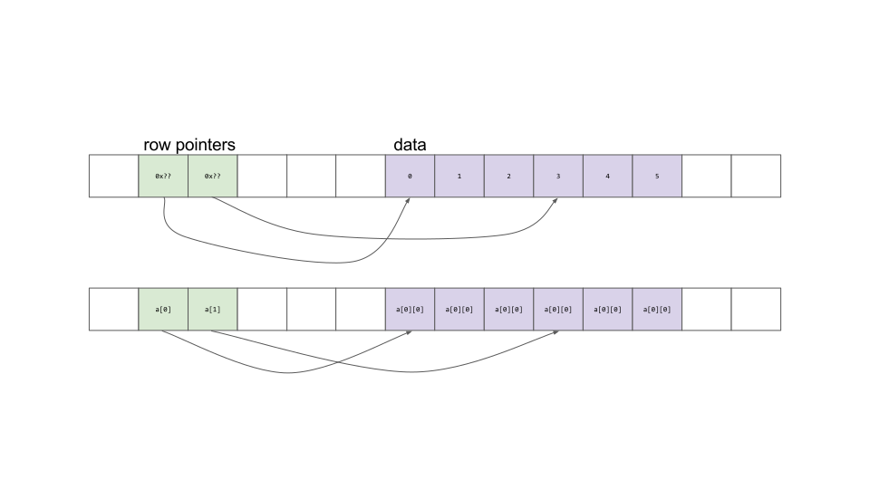

# Static-like dynamic array

Some people like to access arrays in C and C++ using "double square bracket"
notation.  For example, one would access the item at row `i` and column `j` of a
2D array with the notation `a[i][j]`.  In CME 211, we have used this style with
both static arrays and Boost `multi_array`s.  This challenge is to use C++
memory allocation with the `new` keyword to allocate your own
static-like-dynamic-array.  The "dynamic" part is there because you are
allocating the memory for the array at run-time.  In C++ things called "static"
typically occur at compile time.

## Review

Static arrays in C++ are declared with syntax `int a[R][C];` where `R` and `C`
are integers known at compile time.  Here the variable `a` actually has type
`int**`.  It is a pointer to pointers to `int`s.  The square brackets
automatically compute the offset and deference the value at the desired
position.

In memory, things look like this:



## Challenge

1. Write a C++ function to dynamically allocate memory to be used as a
static-like dynamic array.  My function interface looks like this:

```c++
int** slda_alloc(size_t nrows, size_t ncols);
```

2. Write a C++ to properly free (`delete`) the memory associated with the
array.  My function interface looks like this:

```c++
void slda_free(int** a);
```

## Outline of allocation function

1. use `new` to allocate array for data

2. user `new` to callocate data for row pointers

3. write a loop to properly assign row pointer values to array allocated in step

4. write a `main` function to allocate, zero, print, and delete an array

5. make sure the program executes cleanly in valgrind

## Helper functions

Print 2D array:

```c++
void slda_print(int** a, size_t nrows, size_t ncols) {
  for (size_t i = 0; i < nrows; ++i) {
    bool comma = false;
    cout << "[";
    for (size_t j = 0; j < ncols; ++j) {
      if (comma) {
        cout << ", ";
      } else {
        comma = true;
      }
      cout << a[i][j];
    }
    cout << "]" << endl;
  }
}
```

Fill 2D array with zeros:

```c++
void slda_zero(int** a, size_t nrows, size_t ncols) {
  for (size_t i = 0; i < nrows; ++i) {
    for (size_t j = 0; j < ncols; ++j) {
      a[i][j] = 0;
    }
  }
}
```

