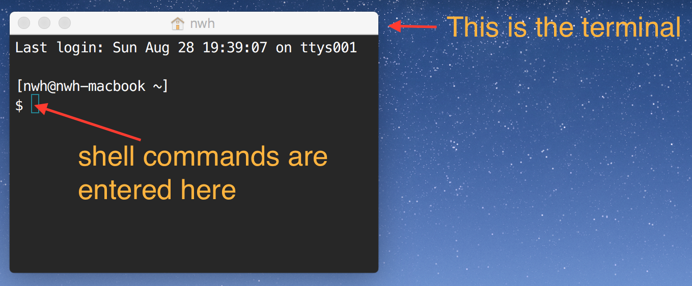

# CME211 Lecture 0 - Command Line

## Reading

From **The Linux Command Line** by William Shotts:
  * <http://linuxcommand.org/lc3_learning_the_shell.php#contents>
  * Read section 1, 2, 3, 5, and 6
  * Skip sections 4, 7 and above unless interested

## Getting oriented

A command line interface (CLI) is a convenient and powerful way to interact with
a computer.  It often takes a bit of adjustment for a person who is used to
graphical user interfaces to get up and running with CLIs.  However, the
investment is always worth it.  CLIs make repetition and automation quite
simple.  It is much easier to send your colleague a shell command to achieve a
task compared to a sequence of GUI instructions.

*Note*: In all documentation for CME211 the dollar sign symbol (`$`) will be
used to indicate a shell command.  All shell commands in these notes (and all
CME211 material) are geared for `bash`, but will likely work in `tcsh`.  The
pound symbol (`#`) is used to indicate shell comments.  Inline, you might see
something like "try the command `$ pwd`".  Code blocks (like the following)
will also be extensively used for demonstration.

```sh
# this is a comment, the $ on the next line is followed by a command
$ pwd
/afs/ir/users/n/w/nwh
# the previous line was output from the pwd command
```

First let's cover a few terms.

### Terminal

A **terminal**, **terminal emulator**, or **console** is a program that displays
text and handles input.  These programs emulate the behavior of physical
[computer terminals](https://en.wikipedia.org/wiki/Computer_terminal) (also
known as dumb terminals) in past computing systems.  Users of modern computing
systems often have many terminal windows open at once.  In the past, users were
limited to the physical terminal they sat behind.

On macOS, the built-in terminal program is called `Terminal.app`.  It is located
in `/Applications/Utilities`.  One convenient way to start the program is to
search for `terminal` using Spotlight.

### Shell

A **shell** is a program that executes commands from the user and displays the
result.  There are many different shell programs out there.  `bash` is quite
popular and is the default on macOS and most Linux distributions.  For a time,
`tcsh` was the default **shell** on Farmshare systems.  It is possible to change
the login shell with the `chsh` command.



### Path

A **path** specifies the location of a file or directory in a file system
hierarchy.  On unix-like systems (e.g. macOS and Linux) a single slash (`/`)
indicates the very top (or root) of the file system.  In longer path names,
directories are separated by slashes.  The last item (lacking a slash) may be
either a file or a directory.  If a path ends with a slash, the last item is a
directory.

Examples:

* `/Users/nwh/Downloads`: this is the downloads directory on my Mac.
* `/Users/nwh/Downloads/`: this is also the downloads directory on my Mac.  Note
  the trailing slash to indicate that `Downloads` is a directory.
* `/Users/nwh/Downloads/TLCL-16.07.pdf`: this is the path to a downloaded PDF.

### Home directory

Every user on a unix-like system has a **home directory**.  This is where the
user can save their work.  On macOS, home directories are located in `/Users`.
My home directory is `/Users/nwh`.  On many Linux systems, home directories are
placed in `/home`.  On Farmshare systems, home directories are organized in
subdirectories based on the first two characters of the user name.  My user name
is `nwh`.  Thus, the path to my home directory on Farmshare is
`/afs/ir/users/n/w/nwh`.

## Moving around

Shell commands are executed relative to a **working directory**.  Usually, when
a shell first starts, the working directory is the user's home directory.

* `pwd` - print working directory
* `cd` - change directory

Special directory aliases:

* `~` - user's home directory
* `..` - directory one higher in filesystem
* `.` - alias for working directory

The command `$ cd -` changes to the previous directory.

### Important note: avoid spaces in directory and file names

It is best to not use spaces in directory or file names.  Most shell programs
use a space as a delimiter between commands and arguments.  Thus, spaces in file
or directory names need to be escaped or quoted -- a thing that is easy to
forget.

For example, let's say we have a directory called "`my docs`".  If we try to
enter the directory with `cd` with out handling the space, we get an error:

```sh
$ cd my docs
-bash: cd: my: No such file or directory
```

To make this work, we can either quote the directory name:

```sh
$ cd "my docs"
```

Or escape the space with a backslash:

```sh
$ cd my\ docs
```

## Looking at things

* `ls` - list files in directory
* `cat` - dump a file to terminal
* `less` - open file in a "pager" (hit `q` to quit)
* `file` - inspect file type

## Manipulating files

* `cp` - copy files and directories
* `mv` - move or rename files and directories
* `rm` - remove files and directories
  (**be careful:** files cannot be recovered after `rm`)
* `touch` - create file or update timestamp
* `mkdir` - create directories

## Inspecting commands

* `type` - Display information about command type
* `which` - Locate a command
* `help` - Display reference page for shell builtin
* `man` - Display an on-line command reference (hit `q` to quit)

## Resources

* <http://linuxcommand.org/>
* <http://www.pixelbeat.org/cmdline.html>
* <http://software-carpentry.org/>
  * <http://swcarpentry.github.io/shell-novice/>
  * <https://www.youtube.com/watch?v=hAHJ0xGKMBk>
