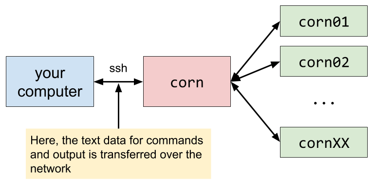

# CME211 Lecture 0 - Remote Computing

Often various resources (data, programs, high performance computing) are located
somewhere other than the computer we have in front of us.  There are many tools
and methods for accessing remote computing resources.  In CME211, we will use
`ssh` to access the shared computing resources managed by [Stanford Research
Computing][srcc].  In particular, we will be using the `corn` servers on
the [Farmshare][farmshare] system.

[srcc]: https://srcc.stanford.edu/
[farmshare]: https://web.stanford.edu/group/farmshare/cgi-bin/wiki/index.php/Main_Page

## Structure of `corn`

The `corn` servers are accessed through the address `corn.stanford.edu`.  The
"master node" is called `corn`.  This will send users to one of the worker
nodes, designated `cornXX` where `XX` is a number.



## Log into `corn` using `ssh`

`ssh` stands for "secure shell".  The program encrypts the communication between
client and server.  The command to log into `corn.stanford.edu` via ssh is:

```
$ ssh [stanford_username]@corn.stanford.edu
```

Here, `[stanford_username]` needs to be replaced by your username.  SSH will
then attempt to locate the server, authenticate the user, and provide access
to a shell.

Here is the terminal output when I log into `corn.stanford.edu`.

```
$ ssh nwh@corn.stanford.edu
Warning: Permanently added the RSA host key for IP address '171.67.216.71' to the list of known hosts.
nwh@corn.stanford.edu's password:
Authenticated with partial success.
Duo two-factor login for nwh

Enter a passcode or select one of the following options:

1. Duo Push to XXX-XXX-XXX
2. Phone call to XXX-XXX-XXX
3. SMS passcodes to XXX-XXX-XXX

Passcode or option (1-3): 1
Success. Logging you in...
Welcome to Ubuntu 14.04.5 LTS (GNU/Linux 3.13.0-85-generic x86_64)

# many lines omitted

For questions or concerns, please contact:
 research-computing-support@stanford.edu

[nwh@corn06 ~]
$ pwd
/afs/ir/users/n/w/nwh
# nwh is now logged into corn06!
```

For more information on SSH, see `$ man ssh`.

## Transfer files to and from `corn` using `scp`

The `scp` (stands for "secure copy") tool can be used to copy files to and from
a remote computer running an SSH server.  The following command will copy from
`source_file` to `dest_file`:

```sh
$ scp source_file dest_file
```

If one (or both) of the files is on a remote computer, then the user and server
address must be specified.  For example, I could copy the file `demo/kitty.txt`
to my home directory on `corn` with the following command:

```
$ scp demo/kitty.txt nwh@corn.stanford.edu:~/
# authentication
kitty.txt                                      100%  187     0.2KB/s   00:00
```

Now looking on `corn`:

```
[nwh@corn06 ~]
$ ls
WWW  bin  config  kitty.txt
```

## Other tools

There are numerous software tools for working with files on remote computing
systems.  We link to a few here.

### Web utilities

The Stanford WebAFS (<https://afs.stanford.edu/>) provides a web interface to
files on Farmshare.

Google has a beta [Chrome-based SSH client][chrome-ssh].  This may not be around
for long as Google will soon be [deprecating Chrome Apps][chrome-apps].

[chrome-ssh]: https://chrome.google.com/webstore/detail/secure-shell/pnhechapfaindjhompbnflcldabbghjo?hl=en
[chrome-apps]: http://blog.chromium.org/2016/08/from-chrome-apps-to-web.html

### Programs for macOS

macOS comes with `ssh` and `scp`.  The program Fetch provides a GUI for file
transfer: <https://uit.stanford.edu/software/fetch>.  The `rsync` command may
be used to sync an entire directory.

### Programs for Windows

Windows does not have a built-in unix-like terminal.  PowerShell and `cmd.exe`
are not suitable replacements.  There are many programs that provide unix-like
environments on Windows (listed below).  The author of these notes has no
experience with any of the following tools.

* <https://msys2.github.io/>
* <https://www.cygwin.com/>
* <http://www.mingw.org/>
* New! Ubuntu on Windows: <https://insights.ubuntu.com/2016/04/14/howto-ubuntu-on-windows-2/>

Here is a list of Windows GUI based tools to for accessing remote computers:

* SecureCRT: <https://uit.stanford.edu/software/securecrt>
* SecureFX: <https://uit.stanford.edu/software/securefx>
* PuTTY: <http://www.chiark.greenend.org.uk/~sgtatham/putty/download.html>
* Bitvise SSH client: <https://www.bitvise.com/ssh-client>
