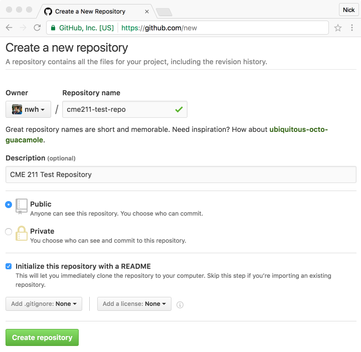
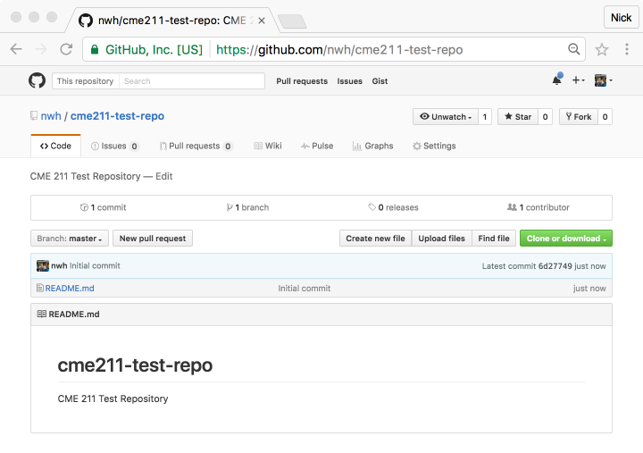
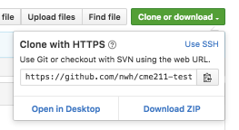
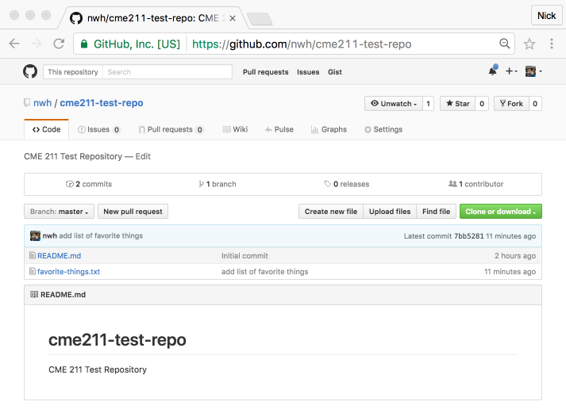

# CME211 Lecture 0 - Git and GitHub

*Git* is a software tool for managing changes, primarily in software development
projects.  There are many other tools for [version control][vc].  Git is
powerful, fast, and widely-used.

*GitHub* is a web-based service that hosts Git repositories and facilitates
collaboration of large teams.  [Bitbucket][bitbucket] and [GitLab][gitlab]
provide similar services.

[vc]: https://en.wikipedia.org/wiki/List_of_version_control_software
[bitbucket]: https://bitbucket.org/
[gitlab]: https://about.gitlab.com/

## 2016-09-19 Update: Farmshare user directory

These notes have been updated after recording of the lecture screencast to
reflect issues between `AFS` and `git`.  We were running into timeout issues
when attempting to clone a repository from GitHub on to our AFS-based home
directory on Farmshare.  The solution is to use the farmshare user directory
located at `/farmshare/user_data/[sunet_id]` instead of AFS.  The notes have
been updated to reflect this change.  The screencasts will still refer to using
AFS space.

See the sections on "GitHub Repo Cloning" and "Directory paths" on the
[Farmshare User Guide][farmshare-user-guide] for some more information.

[farmshare-user-guide]: https://web.stanford.edu/group/farmshare/cgi-bin/wiki/index.php/User_Guide

## Watch

Please watch the 4 introductory videos on the official `git` website:

* <https://git-scm.com/videos>

They will take about 25 minutes total and provide a decent orientation for the
motivation behind version control and `git`.

## Reading

From <https://git-scm.com/book/en/v2> read all of Chapter 1 and Chapter 2,
sections 1 to 5.

## Follow along for CME211

These instructions are focused on the use of `git` and GitHub for the purposes
of CME211.  Note that `nwh` is both my Stanford *and* GitHub username.  Thus,
`nwh` will be used in the demonstrations that follow.  You must replace `nwh`
with either your Stanford or GitHub username in the appropriate context.

## Obtain a GitHub account

1. Visit <https://github.com/> and sign up for a new account (if you don't
   already have one).
2. Visit <https://education.github.com/> to request an education discount which
   allows you to have unlimited private repositories while you are a student.
   Normal, free GitHub accounts grant users unlimited public repositories.

## Create a test repository in personal account on GitHub

* Visit <https://github.com/new> when logged into GitHub.

* Create a new repository with the following settings:
  * Repository Name: cme211-test-repo
  * Description: "CME211 Test Repository"
  * Select **Public**
  * Select **Initialize this repository with a README**



* After clicking "Create repository" you will be taken to the repository
  homepage:



* Click on the green "Clone or download" button to copy the repository link.



## Log in to `corn.stanford.edu` via `ssh` and configure `git`

Note: see [Farmshare two-factor authentication documentation][corn-2fa] to
configure more convenient access to `corn.stanford.edu` via SSH.

[corn-2fa]: https://web.stanford.edu/group/farmshare/cgi-bin/wiki/index.php/Main_Page#Duo_Two-Factor

```sh
# on host, log into corn
$ ssh nwh@corn.stanford.edu
# authenticate
# now on corn
[nwh@corn21 ~]
$ pwd
/afs/ir/users/n/w/nwh
```

We need to tell `git` who we are.  This is achieved with the following commands:

```sh
# on corn
$ git config --global user.name "John Doe"
$ git config --global user.email johndoe@example.com
```

Replace the name and email with your information.  It is also a good idea to
tell `git` which editor you want to use for commit messages.  For new users, I
recommend using `nano` for this purpose:

```sh
$ git config --global core.editor nano
```

These commands store information in the user's `git` configuration file, located
at `~/.gitconfig`.  You can inspect the contents of the file with `cat`.  Here
is mine:

```sh
$ cat ~/.gitconfig
[user]
	name = Nick Henderson
	email = nwh@stanford.edu
[core]
	editor = nano
```

See: <https://git-scm.com/book/en/v2/Getting-Started-First-Time-Git-Setup>

## Clone the test repository

When logged into `corn`, first navigate to your Farmshare user directory located
at `/farmshare/user_data/[sunet_id]` then **clone** the repository you just
created.  It is easiest to copy the HTTPS link from the repository homepage.
Here is a log of the process:

```sh
# on corn.stanford.edu
$ pwd
/afs/ir/users/n/w/nwh
$ cd /farmshare/user_data/nwh
$ ls
# no output means the directory is empty (your directory may not be empty)
$ git clone https://github.com/nwh/cme211-test-repo.git
Cloning into 'cme211-test-repo'...
remote: Counting objects: 3, done.
remote: Total 3 (delta 0), reused 0 (delta 0), pack-reused 0
Unpacking objects: 100% (3/3), done.
Checking connectivity... done.
$ ls
cme211-test-repo
```

Note: if you just logged into `corn.stanford.edu` for the first time, your
`/farmshare/user_data/[sunet_id]` directory may not exit.  The online
documentation says that you need to wait about 30 minutes for the directory to
be created.  Please alert the teaching staff if your directory does not show up
after this amount of time.

## Add a new text file

Go into the `cme211-test-repo` directory and use a text editor (e.g. `nano`) to
create a file called `favorite-things.txt`:

```sh
$ pwd
/farmshare/user_data/nwh
$ cd cme211-test-repo/
$ ls
README.md
$ nano favorite-things.txt
# add some favorite things to the text file
$ ls
README.md  favorite-things.txt
# we can use cat to print the text file to the terminal
$ cat favorite-things.txt
pac-man
swimming
naps
2048
cycling
pop corn
olive oil
coffee
```

## Add file to repo, commit changes, push to GitHub

Check the **status** of the repository:

```sh
$ git status
On branch master
Your branch is up-to-date with 'origin/master'.

Untracked files:
  (use "git add <file>..." to include in what will be committed)

	favorite-things.txt

nothing added to commit but untracked files present (use "git add" to track)
```

**Add** the file to the repository:

```sh
$ git add favorite-things.txt
$ git status
On branch master
Your branch is up-to-date with 'origin/master'.

Changes to be committed:
  (use "git reset HEAD <file>..." to unstage)

	new file:   favorite-things.txt
```

**Commit** changes to repo with a commit message:

```sh
$ git commit -m "add list of favorite things"
[master 7bb5281] add list of favorite things
 1 file changed, 9 insertions(+)
 create mode 100644 favorite-things.txt
```

**Push** the change up to GitHub (will need to authenticate):

```sh
$ git push origin master
Username for 'https://github.com': nwh
Password for 'https://nwh@github.com':
Counting objects: 4, done.
Delta compression using up to 8 threads.
Compressing objects: 100% (3/3), done.
Writing objects: 100% (3/3), 357 bytes | 0 bytes/s, done.
Total 3 (delta 0), reused 0 (delta 0)
To https://github.com/nwh/cme211-test-repo.git
   6d27749..7bb5281  master -> master
```

In the above command:

* `origin` is the name of the remote repository
  (`https://github.com/nwh/cme211-test-repo.git` in my case, see `$ git remote
  -v`)

* `master` is the name of the remote branch you want to push to.  For CME211 we
  will use the default name `master` for the local and remote branch we work in.
  (You can list all branches with `$ git branch -av`.)

## Modify file on GitHub, pull to `corn`

Now visit the webpage for your test repository.  If everything went well, you
will see `favorite-things.txt` in the list of files.  My page looks like this:



Use the GitHub interface to edit `favorite-things.txt` and create a new file.
I will call my new file `least-favorite-things.txt`.

Go back to your `corn` terminal (or log back in if needed).  **Pull** the
changes you made up on GitHub to your repository on `corn`:

```sh
$ pwd
/farmshare/user_data/nwh/cme211-test-repo
$ git pull
remote: Counting objects: 3, done.
remote: Compressing objects: 100% (3/3), done.
remote: Total 3 (delta 0), reused 0 (delta 0), pack-reused 0
Unpacking objects: 100% (3/3), done.
From https://github.com/nwh/cme211-test-repo
   7bb5281..f091800  master     -> origin/master
Updating 7bb5281..f091800
Fast-forward
 least-favorite-things.txt | 4 ++++
 1 file changed, 4 insertions(+)
 create mode 100644 least-favorite-things.txt
$ ls
README.md  favorite-things.txt	least-favorite-things.txt
$ cat least-favorite-things.txt
butter
mayonnaise
superlatives
fettuccine alfredo
```

Type `$ git log` to view the commit history.

## Note on merging

Things can get complicated when changes are made to the same file in parallel at
different locations (e.g. `corn` and GitHub).  The result of this will be errors
on a `push` or merge conflicts on a `pull`.  We will discuss this issue in more
detail in a future set of notes.  For now, take care to not update your
repository in more that one location with out syncing up.

## Warning: Dropbox

Maintaining a Git repository inside of Dropbox (or any other file syncing
service) often leads to a corrupt Git repository.  It is best to maintain your
local git repositories outside of any automatically synced folder.

## Summary

This set of notes covered the main features of Git that are required for CME211.
These are:

* Creating a new repository (not actually needed, because HW0 will automatically
  generate an empty repo for CME211 homeworks)
* Configuring with `$ git config`
* Cloning (getting a fresh copy) a repo with `$ git clone`
* Checking repository status with `$ git status`
* Adding and committing a new file with `$ git add` and `$ git commit`
* Pushing to GitHub with `$ git push`
* Pulling remote changes with `$ git pull`

If you want to learn more, please visit the links provided below.

## Resources

* <https://git-scm.com/documentation>
* <https://try.github.io/>
* <http://gitref.org/>
* <http://software-carpentry.org/>
  * <http://swcarpentry.github.io/git-novice>
  * <https://www.youtube.com/watch?v=hKFNPxxkbO0>
