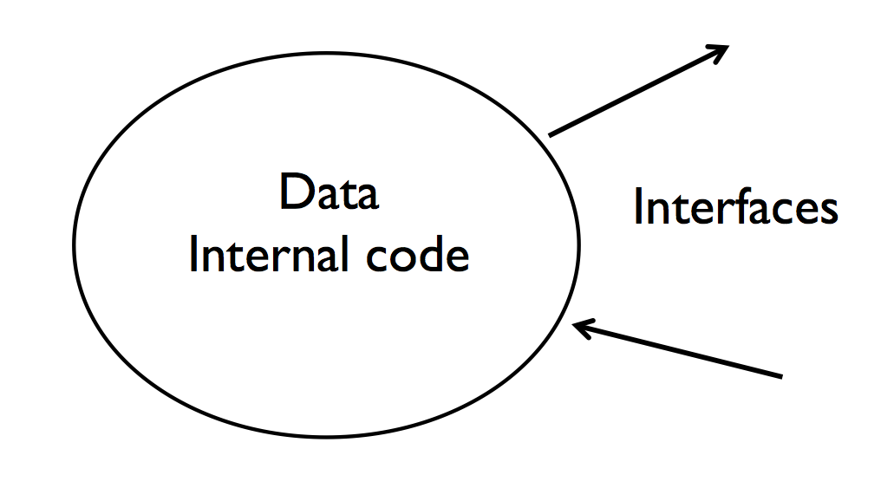

# CME 211: Lecture 6
October 11, 2018

## Introduction to Object Oriented Programming


### Procedural programming

In *procedural programming* (also known as *imperative programming*) you
implement your computation in terms of variables (integers, doubles, etc.), data
structures (arrays, lists, dictionaries, etc.), and procedures (functions,
subroutines, etc.).  The programmer is responsible for designing the procedure
(or sequence of instructions) that the computer will follow.

Most of the widely used programming languages (Python, C++, Fortran, Java,
MATLAB, etc.) are procedural but also support Object Oriented Programming
(OOP).

Some alternatives to *procedural programming* include:

* *functional programming*: structuring a computation as the composition of pure
  functions.  See: [Haskell](https://www.haskell.org/), [Clojure](https://clojure.org/), [Scheme](https://en.wikipedia.org/wiki/Scheme_(programming_language)), and [Functional
  Programming in Python](https://docs.python.org/3/library/functional.html)

* *declarative programming*: making a set of declarations and asking a computer, usually via a solver, to
  produce a result where all declarations hold true:

  * *equation based programming* In a mathematical programming language (GAMS, AMPL, JuMP, CVX, CVXPY, Modelica, gPROMS), the
    programmer writes down a set of equations and/or inequalities (constraints) and
    asks a solver to find a solution. Some may argue that equation-based programming is just a variant of object oriented programming.

  * Also **Boolean satisfiability problem**:
    see <https://en.wikipedia.org/wiki/Boolean_satisfiability_problem>

### Object oriented programming in a nutshell

Object oriented programming is based around the concept of "objects".  Objects have two kinds of
*attributes* (accessed via `.` sytax): data attributes (or instance variables)
and function attributes (or *methods*).  Object data is typically modified by
object methods.


### Why object oriented programming?

* Concept of object oriented programming has been around since 1960s

* Gained popularity in the 1980s and 1990s with the development and
  standardization of C++, and faster computers that mitigated the overhead of the
  abstractions

* Abstraction, modularity, and reusability are some of the most commonly cited
  reasons for using object oriented programming

* Almost all new software development uses some degree of object oriented programming (for better or worse)

* In Python, everything is an object.  Proper use of object oriented programming features allows
  programmers to write code that integrates nicely into the Python language
  and set of libraries.

### Why not object oriented programming?

* Proper object oriented programming design is hard.  There is a cottage industry of tools and books.

* Programmers tend to abuse object oriented programming features leading to code bases that are *extremely*
  difficult to work with.  (This might also mean **job security**)


### Abstraction

* Represent data and computations in a familiar form

  * Car object, with an engine object, and tire objects

* Make programmers more productive

  * Salaries are expensive compared to computers

* Too much abstraction can be a bad thing if it has a significant impact on
  performance

  * Desktop computers really are cheap

  * Supercomputers are not cheap

### Objects

* In object oriented programming you express your computations in terms of *objects*, which are instances
  of *classes*

* Classes are blueprints for objects


* Classes specify data and the methods to use or interact with that data

### Class / object example 1: list

```python
a = list()
a.append(5)
a.append(19)
a.append(3)
a
```

```python
a.sort()
a
```

* `list()` returns an object which is an instance of the *list* class
* `append()` and `sort()` are *methods*
* 3, 5, 19 are the *data* maintained by the object


### Class / object examples 2: file objects

Here is some code to write to a file:

```python
f = open("hello.txt", "w")
f.write("hello cme211!\n")
f.close()
```

* The `open()` function returns an *object* which is an instance of the *file
  class*

* `write()` and `close()` are methods of the *file class*

Let's look at the documentation for `open()` via `help(open)`:

```
Help on built-in function open in module io:

open(file, mode='r', buffering=-1, encoding=None, errors=None, newline=None, closefd=True, opener=None)
    Open file and return a stream.  Raise IOError upon failure.

[text omitted]

open() returns a file object whose type depends on the mode, and
through which the standard file operations such as reading and writing
are performed. When open() is used to open a file in a text mode ('w',
'r', 'wt', 'rt', etc.), it returns a TextIOWrapper. When used to open
a file in a binary mode, the returned class varies: in read binary
mode, it returns a BufferedReader; in write binary and append binary
modes, it returns a BufferedWriter, and in read/write mode, it returns
a BufferedRandom.

[text omitted]
```

Now let's look at the file object with `help(f)`:

The structure of file input-output objects has changed quite a bit between
Python 2 and Python 3.  For basic uses, the behavior is the same and simple file
IO code should be the same.  

### Modularity and reusability

* High level languages like Python, Java, C++, etc. include classes for working
  with files, holding data (lists and dictionaries), etc.

* So you do not have to design and create your own classes if someone else has
  already done the work for you

* But you might want to create classes that are specialized to the needs of your
  applications, so they can be used (and reused) by yourself and others

### Object oriented programming in Python

* New kinds of objects can be created in Python by defining your own classes

* Classes are the blueprint for creating objects which are known as instances of
the class

* Classes have *attributes*

  * Variables (data) are called class *variables*

  * Functions for interacting with the class are called *methods*

  * Attributes are accessed using *dot notation*

### Creating instances

* Instances of a class are created by calling the class object as a function

* Any arguments of the function call are passed to the special `__init__()`
  method

### Python class definition

```python
class Student:
    def __init__(self, id):
        self.id = id
```

* Classes are defined with the `class` keyword
* Followed by the class name and a colon (`:`)
* Followed by the indented class body, containing class *attributes*

### Object initialization

```py
    def __init__(self, id):
        self.id = id
```

* `__init__` is the special name for the initialization method
* `self` is a reference to the specific instance (object) that is calling this
  method.  In the case of the `__init__` method, `self` refers to the object
  being created.  `self` is simply a Python variable and can be renamed
* `id` is the input argument from the call to create a new instance
* `self.id = id` stores the input `id` in the object

### Class definition in action

Let's work with a class called `Student` to create objects that represent and
maintain information about students.

Define the class:

```python
class Student:
    def __init__(self, id):
        self.id = id
```

Remember, everything in Python is an object.  This includes classes:

```python
Student
```

We can think of a Python `class` as object that can produce objects of the class
type.  Let's create a student object:

```python
s = Student(7)
s
```

That output is not terribly useful at this point.  Let's access the `id`
attribute:

```python
print(s.id)
```

### Let's talk about `self`

```python
class Student:
    def __init__(self, id):
        print("inside __init__()")
        print("self = {}".format(self))
        self.id = id

s = Student(7)
print("s    = {}".format(s))
```

Here we see that `self` inside of `__init__` is the same object that is returned
by the call `Student(7)`.

### Object setup

* The optional initialization method is typically used to do setup of class
  variables that will be used throughout the life of the instance

* What kind of class variables might we want to setup for a student class?

### Class variable setup

Let's add an empty dictionary for the classes that the student is enrolled in:

```python
class Student:
    def __init__(self, id):
        self.id = id
        self.courses = {}

s = Student(7)
```

### Architecting our object

* Our object has data about `id` and `classes`

* But how do we do anything with it?

* We need to create additional methods for interacting or *interfacing* with the
  object

### Encapsulation

* The *interface* of an object encapsulates the internal data and code

* *encapsulation* means hiding the details of data structures and algorithms
(internal code)



### Interfaces

* Interfaces protect the user of the class from internal implementation details

* Found a better way to implement the internal representation of the data? No
  problem.  In the interface is the same, internal changes to data representation
  won't affect anything that uses the object.

* New algorithm for the internal processing of that data? No problem

* Screwed up your interface and now need to make changes to the interface?
  Problem

### Defining a regular method

Inside of the `Student` class, we put the `get_id` method:

```python
class Student:
    def __init__(self, id):
        self.id = id
        self.courses = {}
    def get_id(self):
        return self.id
```

* just like defining a Python function

* `self` is a reference to the specific instance that is calling this method

### Access to id

```python
s = Student(7)
print(s)
print(s.get_id())
```

### Check up

How are we doing with interface design?

Is there a way somebody could accidentally change the id given the interface
we've implemented?

Let's test it:

```python
s = Student(7)
print(s)
id = s.get_id()
print("id = {}".format(id))
id = 42
print("id = {}".format(id))
print("s.get_id() = {}".format(s.get_id()))
```

The reference returned by `get_id()` cannot be used to change the assignment of
the reference within the object.

```python
s.id = "I have changed the id to a string, probably not good"
print("s.get_id() = {}".format(s.get_id()))
```

The `id` attribute is accessible and can be assigned to just like any Python
variable.  This may not be desirable behavior.

### Adding classes / grades

```python
class Student:
    def __init__(self, id):
        self.id = id
        self.courses = {}
    def get_id(self):
        return self.id
    def add_class(self, name, gradepoint):
        self.courses[name] = gradepoint
        sumgradepoints = float(sum(self.courses.values()))
        self.gpa = sumgradepoints/len(self.courses)
    def get_gpa(self):
        return self.gpa

s = Student(7)
s.add_class("gym", 4)
s.add_class("math", 3)
print("GPA = {}".format(s.get_gpa()))
```

### Getting courses

```python
class Student:
    def __init__(self, id):
        self.id = id
        self.courses = {}
    def get_id(self):
        return self.id
    def add_class(self, name, gradepoint):
        self.courses[name] = gradepoint
        sumgradepoints = float(sum(self.courses.values()))
        self.gpa = sumgradepoints/len(self.courses)
    def get_gpa(self):
        return self.gpa
    def get_courses(self):
        return self.courses

s = Student(7)
s.add_class("gym", 4)
s.add_class("math", 3)
print("GPA = {}".format(s.get_gpa()))
print("courses = {}".format(s.get_courses()))
```

If a method returns a reference to a mutable object, then changing that object
"outside" of the class will change the data "inside" of the class.

```python
class Student:
    def __init__(self, id):
        self.id = id
        self.courses = {}
    def get_id(self):
        return self.id
    def add_class(self, name, gradepoint):
        self.courses[name] = gradepoint
        sumgradepoints = float(sum(self.courses.values()))
        self.gpa = sumgradepoints/len(self.courses)
    def get_gpa(self):
        return self.gpa
    def get_courses(self):
        return self.courses

s = Student(7)
s.add_class("gym", 4)
s.add_class("math", 3)

courses = s.get_courses()
courses["english"] = 4    # <~ Not the best idea

print("GPA = {}".format(s.get_gpa()))
print("courses = {}".format(s.get_courses()))
```

### Interfaces and references

* It is easy to accidentally let a method provide a reference to a mutable data
  structure within your object.

* Once you have handed out that reference someone can manipulate your internal
  data and perhaps get the object into an unexpected state.

* You really need to think about what you pass out of your object if you want to
  have strong encapsulation.

### Public attributes

Default behavior is that all attributes are public, i.e. accessible using dot
notation

```python
class Student:
    def __init__(self, id):
        self.id = id
        self.courses = {}
    def get_id(self):
        return self.id

s = Student(7)
print("s.id = {}".format(s.id))
s.id = 9
print("s.get_id() = {}".format(s.get_id()))
```

### Private attributes

Attributes can be made *private* by using a double underscore prefix for the
name:

```python
class Student:
    def __init__(self, id):
        self.__id = id
        self.courses = {}
    def get_id(self):
        return self.__id

s = Student(7)
print("s.get_id() = {}".format(s.get_id()))
print("s.id = {}".format(s.__id))
```

### "Privacy" through obscurity

Python object attributes are never really private.  The `__` before the attribute
tells Python to obscure tha name in some way.  This is called name or symbol
mangling.

```python
s._Student__id
```

The "private" attribute is still accessible by prefixing it with
`_<classname>__`.

### Better to return a copy over a reference

```python
import copy

class Student:
    def __init__(self, id):
        self._id = id
        self._gpa = 0.0
        self._courses = {}
    def get_id(self):
        return self._id
    def add_class(self, name, gradepoint):
        self._courses[name] = gradepoint
        sumgradepoints = float(sum(self._courses.values()))
        self._gpa = sumgradepoints/len(self._courses)
    def get_gpa(self):
        return self._gpa
    def get_courses(self):
        return copy.deepcopy(self._courses)

s = Student(7)
s.add_class("gym", 4)
s.add_class("math", 3)
courses = s.get_courses()
courses["english"] = 4
print("GPA = {}".format(s.get_gpa()))
print("courses = {}".format(s.get_courses()))
```

### What not to do

Python is dynamic, which is great.  But you should not do this:

```python
class SimpleClass:
    pass

a = SimpleClass()
a.new_attribute = "hi cme211"
```

This adds an attribute to the object referred to by `a`, but not other objects
of the same class:

```python
b = SimpleClass()
b.new_attribute
```

### Iterators revisited

A Python **iterator** is an object which implements methods `__iter__` and
`__next__`. An object that contains an iterator is called **iterable**.
Most of Python containers such as lists, tuples or sets are iterable.
Here we show an example iterator class that returns powers of 2.
(Source [programiz.com](https://www.programiz.com/python-programming/methods/built-in/list))


```python
class PowTwo:
    def __init__(self, max):
        self.max = max
    
    def __iter__(self):
        self.num = 0
        return self
        
    def __next__(self):
        if(self.num >= self.max):
            raise StopIteration
        result = 2 ** self.num
        self.num += 1
        return result

powTwo = PowTwo(5)
powTwoIter = iter(powTwo)

print(list(powTwoIter))
```
Python's `iter()` function returns the iterator from an iterable object.


### Intro to object oriented programming summary

* Object Oriented Programming is about implementing abstractions such that data,
  and the associated operations on it, are represented in a way that is more
  familiar to humans

* Mechanics of object oriented programming are about the same as procedural programming, but developing
  good abstractions can take a lot of thought

### Recommended Reading

*Learning Python, Fifth Edition* by Mark Lutz

* Chapter 26: Object Oriented Programming: The Big Picture

* Chapter 27: Class Coding Basics
