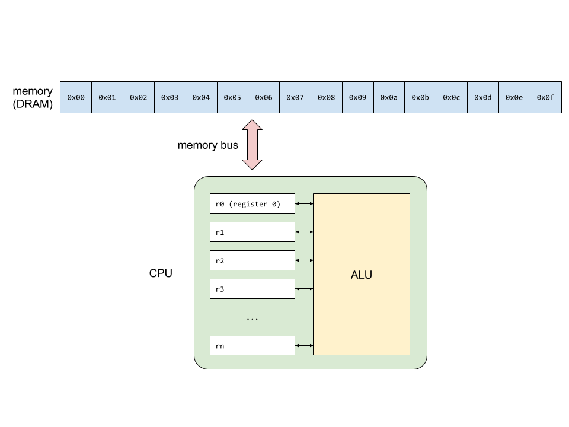
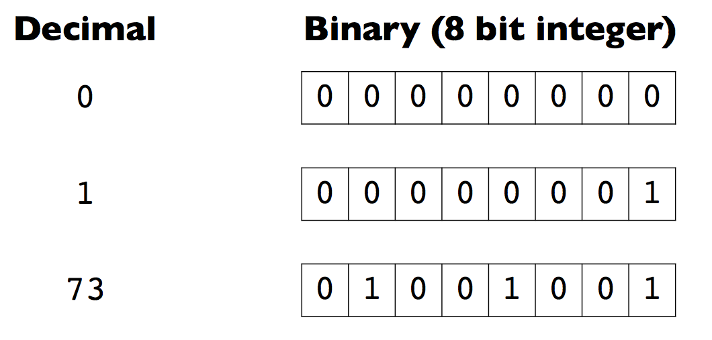
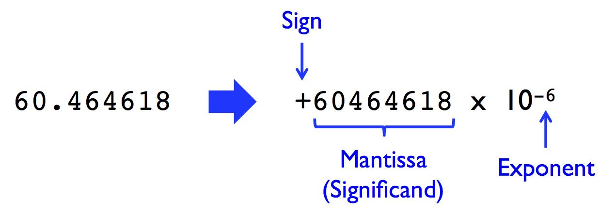

# CME 211 Lecture 10 - Representation of data

## Motivation

### Runtime performance

Let's compute $2^i$ for $i \in [0,n)$.

Using lists:

```python
L = range(1000)
%timeit [i**2 for i in L]
```

Using Numpy:

```python
import numpy as np

a = np.arange(1000)
%timeit a**2
```

### Programmer productivity

Let's add some 2D arrays.

In Python with lists of lists:

```python
nrows = 3
ncols = 2

def my_ones(nrows, ncols):
    A = []
    for r in range(nrows):
        A.append([])
        for c in range(ncols):
            A[r].append(1.0)
    return A

def matrix_add(A,B):
    C = []
    for r in range(len(A)):
        C.append([])
        for c in range(len(A[r])):
            C[r].append(A[r][c] + B[r][c])
    return C

A = my_ones(nrows,ncols)
B = my_ones(nrows,ncols)
C = matrix_add(A,B)
C
```

With Numpy:

```python
nrows = 3
ncols = 2

A = np.ones((nrows,ncols))
B = np.ones((nrows,ncols))

C = A + B
C
```

Let's check performance again:

```python
%timeit A = my_ones(1000,500)
```

```python
%timeit A = np.ones((1000,500))
```

```python
nrows = 1000
ncols = 500

A = my_ones(nrows,ncols)
B = my_ones(nrows,ncols)

%timeit C = matrix_add(A,B)
```

```python
nrows = 1000
ncols = 500

A = np.ones((nrows,ncols))
B = np.ones((nrows,ncols))

%timeit C = A + B
```

### Correctness

> **Some disasters attributable to bad numerical computing**
> 
> By: Douglas N. Arnold
> See: <http://www.math.umn.edu/~arnold/disasters/disasters.html>
> 
> Have you been paying attention in your numerical analysis or scientific
> computation courses? If not, it could be a costly mistake. Here are some real
> life examples of what can happen when numerical algorithms are not correctly
> applied.
> 
> The Patriot Missile failure, in Dharan, Saudi Arabia, on February 25, 1991 which
> resulted in 28 deaths, is ultimately attributable to poor handling of rounding
> errors.
> 
> The explosion of the Ariane 5 rocket just after lift-off on its maiden voyage
> off French Guiana, on June 4, 1996, was ultimately the consequence of a simple
> overflow.
> 
> The sinking of the Sleipner A offshore platform in Gandsfjorden near Stavanger,
> Norway, on August 23, 1991, resulted in a loss of nearly one billion dollars. It
> was found to be the result of inaccurate finite element analysis.

See also: <https://people.eecs.berkeley.edu/~wkahan/>


## Integers

* Computers represent and store everything in *binary*

* Binary, a base 2 number system, consists only of 0s and 1s called binary
  digits (bits)

* There are 8 bits in a byte

### Simplified model of computer



### Converting between bases

* One can easily convert numbers between different bases such as binary (base 2)
  and decimal (base 10)

```
| decimal | binary |
|---------|--------|
|       0 |      0 |
|       1 |      1 |
|       2 |     10 |
|       3 |     11 |
|       4 |    100 |
|       5 |    101 |
|       6 |    110 |
|       7 |    111 |
```

### Common prefixes

* kilo, mega, giga, tera, peta, exa prefixes:

```
| kilobyte (kB) | 10^3 (or 2^10)  |
| megabyte (MB) | 10^6 (or 2^20)  |
| gigabyte (GB) | 10^9 (or 2^30)  |
| terabyte (TB) | 10^12 (or 2^40) |
| petabyte (PB) | 10^15 (or 2^50) |
| exabyte (EB)  | 10^18 (or 2^60) |
```

* Networking and storage typically use base 10 while memory is specified in
terms of base 2

* Technically prefixes and symbols are different, e.g. Kilobyte or kibibyte with
symbols KB / KiB / Kbytes for base 2

### Computer storage of a number

* At the hardware level computers **don't** do variable length representations of
numbers

* We might write:

  * 4 as `100`, using 3 bits

  * 73 as `1001001`, using 7 bits

### Fixed storage widths


### Integer representation

* At the hardware level computers typically handle integers using 8, 16, 32, or
64 bits



### Integer range

* For `n` bits, there are only `2^n` unique combinations of 0s and 1s

* This limits the range of what can be represented with a fixed number of bits

```
2^8  = 256
2^16 = 65536
2^32 = 4294967296
2^64 = 18446744073709551616
```

### Sign bit

* Use one bit for sign and remaining bits for magnitude


* Reduces the range of the magnitude from `2^n` to `2^(n-1)`

### Offset

* Apply an offset or bias to reinterpret the conversion between binary and
decimal


* Again, effectively reduces the range of the magnitude

### Unsigned integers

* Many programming languages support unsigned integers

* Python itself does not have unsigned integers, but Numerical Python (`numpy`)
  does

* Can use this to your advantage to expand the effective range available if
  negative numbers don't need to be stored

* But be careful...

### Overflow and underflow

* Attempting to assign a value greater than what can be represented by the data
  type will result in overflow

* Attempting to assigning a value less than what can be represented by the data
  type will result in underflow

* Overflow or underflow tend to cause wraparound, e.g. if adding together two
  signed numbers causes overflow the result is likely to be a negative number

### Range of integer types


### Integers in Python

* In Python 3, values of type `int` may have unlimited range.

```python
i = 52**100
print(type(i))
print(i)
# this is beyond the 64-bit integer range
```

* Python 2 had both fixed size integers (with type `int`) and variable width
  integers (with type `long`).

* Numpy supports fixed-width integers for performance and storage.

## Strings

### ASCII

* American Standard Code for Information Interchange (ASCII) is typically used
  to encode text information

* Characters, numbers, symbols, etc. are encoded using 7 bits (although on
  modern computers they would typically use 8 bits)

  * `A` maps to `1000001` in binary or 65 in decimal
  * `B` maps to `1000010` in binary or 66 in decimal

* Default Python 2 string is ASCII. Possible to get Unicode strings with
  `s = u'I am a unicode string!'`.

### UTF-8

* Default string encoding in Python 3
  is [UTF-8](https://en.wikipedia.org/wiki/UTF-8).
  
* The change from ACSII to Unicode between Python 2 and 3 caused major headaches
  for Python community.

* UTF-8 is a variable width format.  Each character of text may take from 1 to
  4 bytes.

* UTF-8 is backwards compatible with ASCII, because 1-byte codes correspond to
  ASCII characters.
  
* UTF-8 encodes a total of 1,112,064 characters -- enough to represent the
  majority of human character systems.

* Because UTF-8 is variable width, it is not possible to jump to a character at
  a given index. All $n-1$ characters must be scanned to find the $n$-th
  character in a string.

* Great chapter
  on [Python 3 Strings](http://www.diveintopython3.net/strings.html) in *Dive
  Into Python 3* by Mark Pilgrim.

## Floating point numbers

* How do I represent a floating point value using bits?



### Floating point standard

* IEEE (Institute of Electrical and Electronics Engineers) 754 is the technical
  standard for floating point used by all modern processors


* Standard also specifies things like rounding modes, handling overflow, divide
  by zero, etc.

### Floating point and you

* Floating point also has similar potential for overflow and underflow.

* In addition, the limited number of bits for the mantissa means it often needs
  to be rounded.

* Will spend more time on floating point arithmetic in CME 212.

* What Every Computer Scientist Should Know About Floating-Point Arithmetic by
  Goldberg ([link][fp-paper]).

* Floating point numbers in Python are double precision (64-bit).

* Numpy has suppose for 16-bit and 32-bit floating point formats.

[fp-paper]: https://ece.uwaterloo.ca/~dwharder/NumericalAnalysis/02Numerics/Double/paper.pdf
