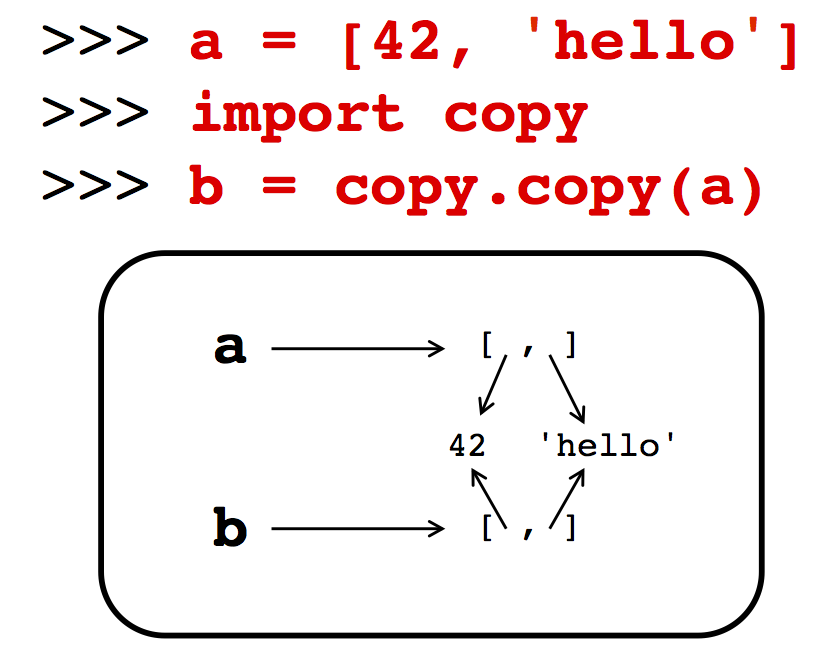

# CME 211: Lecture 7

Monday, October 5, 2015

Topics:

* Review: Python object model

* Python modules

* Python exceptions

## Announcements

* CUDA on Campus Day
<http://icme.stanford.edu/events/nvidia-tech-talks-and-hands-labs>

* Get your GitHub accounts!  You need this to submit assignments from here on.
  We will not process last minute requests.

## Python object model

Let's review and elaborate on Python's object model.  Key things to always keep
in mind:

* everything in Python is an object

* variables in Python are references to objects

### Starting example

```py
>>> a = [42, 19, 73]
>>> b = a
>>> a
[42, 19, 73]
>>> b
[42, 19, 73]
>>> b[0] = 7   # (1.)
>>> b
[7, 19, 73]    # (2.)
>>> a
[7, 19, 73]    # (2.)
>>>
```

1. Item `b[0]` is modified

2. This action affect the object referenced by both `a` and `b`

In this example, `a` is a reference to the list object initially set to `[42,
19, 73]`.  The variable `b` also references the same list.


### Analogy

* This room is like an object

* "Geology Corner Auditorium" is an identifier that references this room

* "320-105" is also an identifier that references this same room

### Objects and references

* Names or identifiers point to or reference an object

* Identifiers are untyped and dynamic (an identifier can reference an integer,
and then reference a string)

```py
>>> a = 5
>>> a = 'hi'
```

* But Python is also strongly typed: you can't add a number and a string because
that doesn't make sense

* Everything in Python is an object: numbers, strings, functions, etc. are all
objects

* An object is a location in memory with a type and a value

### Assignment

* The assignment operation, `=`, can be interpreted as setting up the reference

```py
>>> a = 'hello'
```

1) Create a string object containing `'hello'`

2) Point the identifier a to the newly created string object

### Example


### Example


### Checking references

We can check if two names reference the same object with the `is` operator:

```py
>>> a = [42, 19, 73]
>>> b = a
>>> a is b
True
>>> b = [42, 19, 73]
>>> a is b
False
>>>
```

### Integers and references

Integers are objects also and need to be created in memory:

```py
>>> a = 1024
>>> b = a
>>> a is b
True
>>> a = 1024
>>> b = 1024
>>> a is b
False
>>> a = 16
>>> b = 16
>>> a is b
True
>>>
```

### Preallocated integers

* For interactive usage, Python preallocates permanent integer objects for the
  values `-5` to `256`

* Instead of constantly creating / destroying these objects they are
  permanently maintained

* Integers outside this range are created / destroyed as needed

```py
>>> a = -6
>>> b = -6
>>> a is b
False
>>> a = -5
>>> b = -5
>>> a is b
True
>>> a = 256
>>> b = 256
>>> a is b
True
>>> a = 257
>>> b = 257
>>> a is b
False
>>>
```

### String reuse

String objects may be "reused" internally:

```py
>>> a = 'hello'
>>> b = 'hello'
>>> a is b
True
>>>
```

### Why immutables?

* It's a design decision not uncommon in other languages (e.g. strings are
  immutable in Java)

* Allows for performance optimizations

* Can setup storage for a string once because
it never changes

* Dictionary keys required to be immutable for performance optimizations to
  quickly locate keys

### Containers and element references

* The elements in a list, or the key and value pairs in a dictionary, contain
  references to objects

* Those references can be to "simple" data types like a number or string, or
  more complicated data types like other containers

* There are some restrictions, for example the key objects in a dictionary must
  be immutable (e.g. numbers, strings, or tuples)

### Containers and element references

```py
>>> a = [42, 'hello']
>>> b = a
```


### Copying a list

* Simple assignment does not give us a copy
of a list, only an additional reference to the
same list


* What if we really want an additional copy
that can be modified without changing the
original?

### Shallow copy

```py
>>> a = [42, 'hello']
>>> import copy
>>> b = copy.copy(a)
```



* Constructs a new list and inserts references to
the objects referenced in the original

### Shallow copies and mutables

```py
>>> a = [19, {'grade':92}]
>>> b = copy.copy(a)
>>> a
[19, {'grade': 92}]
>>> b
[19, {'grade': 92}]
>>> a[1]['grade'] = 97
>>> a
[19, {'grade': 97}]
>>> b
[19, {'grade': 97}]
>>>
```


### Deep copy

```py
>>> a = [19, {'grade':92}]
>>> b = copy.deepcopy(a)
>>> a
[19, {'grade': 92}]
>>> b
[19, {'grade': 92}]
>>> a[1]['grade'] = 97
>>> a
[19, {'grade': 97}]
>>> b
[19, {'grade': 92}]
>>>
```


* Constructs a new list and inserts copies of the
objects referenced in the original

### Tuples and immutability

```py
>>> a = [42, 'feed the dog', 'clean house']
>>> import copy
>>> b = copy.copy(a)
>>> c = (a,b)
>>> c
([42, 'feed the dog', 'clean house'], [42, 'feed the dog', 'clean house'])
```

```py
>>> b[0] = 7
>>> c
([42, 'feed the dog', 'clean house'], [7, 'feed the dog', 'clean house'])
>>> c[0][0] = 7
>>> c
([7, 'feed the dog', 'clean house'], [7, 'feed the dog', 'clean house'])
```

```py
>>> c[0] = [73, 'wash dishes', 'do laundry']
Traceback (most recent call last):
File "<stdin>", line 1, in <module>
TypeError: 'tuple' object does not support item assignment
>>>
```


The immutable property of tuples only means I can't change where the arrows
point, I'm still free to change a mutable at the arrow destination

### Memory management

* What happens to those objects that are no longer referenced?


### Garbage collection

* Unreachable objects are garbage collected

* Garbage collection in Python is implemented with reference counting


## Python modules

### Organization

* Your code should be organized in some way

* Code should often be split across multiple files for ease of maintenance and
  reuse

* For large projects you will probably have multiple directories each with
  multiple files

### Modules

* Code in Python can be organized and accessed as modules

* We've already used some modules that are part of Python (math, time, etc.)

* These modules were accessed using the import statement

### Import

Here is an example if importing and using a function from the `time` module:

```py
>>> import time
>>> time.time()
1381091212.070504
>>> time()
Traceback (most recent call last):
File "<stdin>", line 1, in <module>
TypeError: 'module' object is not callable
>>> type(time)
<type 'module'>
>>> type(time.time)
<type 'builtin_function_or_method'>
>>>
```

* Keep in mind that the module name/object is different then the function that
  exists inside of the module

### Reference to a function

Functions are also objects and may be assigned to a variable:

```py
>>> t = time.time
>>> type(t)
<type 'builtin_function_or_method'>
>>> t is time.time
True
>>> t()
1381091266.353158
>>>
```

### Import a single function

We can import a single function from a module:

```py
>>> from time import time
>>> type(time)
<type 'builtin_function_or_method'>
>>> time()
1381091470.26926
>>> import time
>>> type(time)
<type 'module'>
>>> time.time()
1381091483.548532
>>>
```

Another example is `from math import sqrt`.

### Import and rename

We can rename a function in the import statement:

```py
>>> from time import time as timer
>>> type(timer)
<type 'builtin_function_or_method'>
>>> timer()
1381091498.986958
>>>
```

### Wild card import

We can import everything from a module into the global namespace with:

```py
>>> from time import *
>>> type(time)
<type 'builtin_function_or_method'>
>>> time()
1381091614.217997
>>>
```

This is normally not a good idea, because you may unknowingly overwrite some
symbols that have been defined elsewhere.

### Modules and namespaces

* Not only do modules allow you to separate code into multiple files, but they
  also provide distinct namespaces

* Namespaces are particularly important in larger projects where reuse of common
  terms could be confusing at best

* Attribute renaming and/or wild card imports can make code less readable and
  more difficult to debug

### Example

Here we know where `time()` is coming from:

```py
import time
import mymodule
...
t = time.time()
```

Does `time()` come from `time` or `mymodule`?

```py
from time import *
from mymodule import *
...
t = time()
```

**Recommendation:** be explicit when using module functions!

### Writing your first module

See file `code/mymodule1.py`:

```py
def summation(a,b):
    total = 0
    for n in range(a,b+1):
        total += n
    return total

primes = [2, 3, 5, 7, 11, 13, 17, 19, 23, 29, 31, 37, 41, 43, 47]
```

### Using your first module

```py
>>> import mymodule1
>>> mymodule1.summation(1,100)
5050
>>> mymodule1.primes
[2, 3, 5, 7, 11, 13, 17, 19, 23, 29, 31, 37,
41, 43, 47]
>>>
```

### Improving your module

Add test code in file `code/mymodule2.py`:

```py
def summation(a,b):
    total = 0
    for n in range(a,b+1):
        total += n
    return total

primes = [2, 3, 5, 7, 11, 13, 17, 19, 23, 29, 31, 37, 41, 43, 47]

print('Testing function summation():...'),
total = summation(1,100)
if (total == 5050):
    print('OK')
else:
    print('FAILED')
```

### Testing your new module

```py
>>> import mymodule2
Testing function summation():... OK
>>> mymodule2.summation(1,100)
5050
>>> mymodule2.primes
[2, 3, 5, 7, 11, 13, 17, 19, 23, 29, 31, 37,
41, 43, 47]
>>>
```

### Import process

When you do `import mymodule2` several things happen

1. Python interpreter looks for a `.py` file with the same name as the module,
starting with your current directory followed by looking in system wide
locations

2. Code is byte compiled from the `.py` file to a `.pyc` file

3. File is processed from top to bottom

### Locating modules

* Searches for a module are based on directories in
the `sys.path` list

* First item in the `sys.path` list is an empty string, `''``, which is used to
  denote the current directory

```py
$ pwd
/home/nwh/git/cme211-notes/lecture-07
$ ls *.py
mymodule1.py  mymodule2.py
$ python
Python 2.7.5+ (default, Feb 27 2014, 19:37:08)
[GCC 4.8.1] on linux2
Type "help", "copyright", "credits" or "license" for more information.
>>> import sys
>>> sys.path.remove('')
>>> import mymodule1
Traceback (most recent call last):
File "<stdin>", line 1, in <module>
ImportError: No module named mymodule1
>>> sys.path.insert(0,'')
>>> import mymodule1
>>>
```

### .pyc files

```
$ ls *.py*
mymodule1.py  mymodule1.pyc  mymodule2.py  mymodule2.pyc
```

* When you import a file Python byte compiles the file


* `.pyc` files are faster to load, but the runtime performance once you have
* them loaded is exactly the same

### `__name__` and `__main__`

* Special variable `__name__` is equal to `__main__` if the file is being
  executed as the main program

* `__name__` will not be equal to `__main__` if the file is being imported

### "Hiding" code during import

See `code/mymodule3.py`

```py
def summation(a,b):
    total = 0
    for n in range(a,b+1):
        total += n
    return total

primes = [2, 3, 5, 7, 11, 13, 17, 19, 23, 29, 31, 37, 41, 43, 47]

if __name__ == '__main__':
    print('Testing function summation():...'),
    total = summation(1,100)
    if (total == 5050):
        print('OK')
    else:
        print('FAILED')
```

### Another try at importing

```py
>>> import mymodule3
>>> mymodule3.summation(1,100)
5050
>>> mymodule3.primes
[2, 3, 5, 7, 11, 13, 17, 19, 23, 29, 31, 37,
41, 43, 47]
>>>
```

### Running the test code

```
$ python mymodule3.py
Testing function summation()... OK
$
```

### Documenting the module

See `code/mymodule4.py`:

```py
"""
My module of misc code.
"""

def summation(a,b):
    """
    Returns the sum of numbers between, and including, a and b.
    """

    total = 0
    for n in range(a,b+1):
        total += n
    return total

primes = [2, 3, 5, 7, 11, 13, 17, 19, 23, 29, 31, 37, 41, 43, 47]

if __name__ == '__main__':
    print('Testing function summation():...'),
    total = summation(1,100)
    if (total == 5050):
        print('OK')
    else:
        print('FAILED')
```

### Accessing your documentation

```py
>>> import mymodule4
>>> help(mymodule4)
```

```
Help on module mymodule4:

NAME
mymodule4 - My module of misc code.

FILE
/afs/.ir.stanford.edu/users/p/l/plegresl/CME211/Lecture07/mymodule4.py

FUNCTIONS
summation(a, b)
Returns the sum of numbers between, and including, a and b.

DATA
primes = [2, 3, 5, 7, 11, 13, 17, 19, 23, 29, 31, 37, 41, 43, 47]

(END)
```
## Python Error Handling

### Errors in Python

```py
>>> a = [3, 7]
>>> a[2]
Traceback (most recent call last):
File "<stdin>", line 1, in <module>
IndexError: list index out of range
>>> b = {'cupcakes' : 7, 'brownies' : 2}
>>> b['cookies']
Traceback (most recent call last):
File "<stdin>", line 1, in <module>
KeyError: 'cookies'
>>>
```

### Exceptions

* Errors generate exceptions

* Exceptions can potentially be caught

* Uncaught exceptions propagate up to the interpreter, which halts execution and
  displays the information in a traceback

### Exceptions

* Python uses a try/except model for error handling

```py
>>> f = open('thisfiledoesntexist.txt')
Traceback (most recent call last):
File "<stdin>", line 1, in <module>
IOError: [Errno 2] No such file or directory: 'thisfiledoesntexist.txt'
>>> try:
...     f = open('thisfiledoesntexist.txt')
... except IOError:
...     print 'That filename doesn't exist.'
...
That filename doesn't exist.
>>>
```

### Catching multiple exceptions

```py
>>> try:
...     5/0
... except IOError, e:
...     print('I/O error')
... except ZeroDivisionError, e:
...     print('Zero division error')
... except Exception, e:
...     print(e)
...
Zero division error
>>>
```

### Raising exceptions

From `code/mymodule5.py`:

```py
import types

def summation(a,b):
    """
    Returns the sum of numbers between, and including, a and b.
    """

    if (type(a) != types.IntType or type(b) != types.IntType):
        raise ValueError, 'Expected integers'

    total = 0
    for n in range(a,b+1):
        total += n
    return total
```

Using:

```py
>>> import mymodule4
>>> mymodule4.summation(1,'hello')
Traceback (most recent call last):
  File "<stdin>", line 1, in <module>
  File "mymodule4.py", line 11, in summation
    for n in range(a,b+1):
TypeError: cannot concatenate 'str' and 'int' objects
>>> import mymodule5
>>> mymodule5.summation(1,'hello')
Traceback (most recent call last):
  File "<stdin>", line 1, in <module>
  File "mymodule5.py", line 13, in summation
    raise ValueError, 'Expected integers'
ValueError: Expected integers
>>>
```

### Recommended Reading

* Chapter 6: The Dynamic Typing Interlude

* Chapter 22: Modules: The Big Picture

* Chapter 23: Module Coding Basics

* Chapter 33: Exception Basics

* Chapter 34: Exception Coding Details
