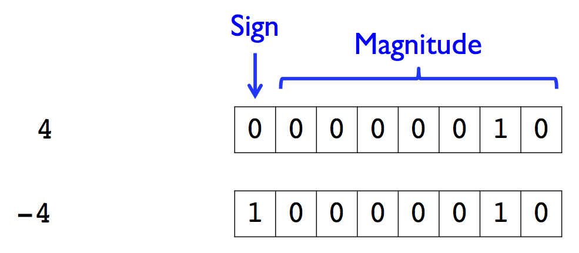

# CME 211 Lecture 10

## Computer representation of numbers

* Computers represent and store everything in *binary*

* Binary, a base 2 number system, consists only of 0s and 1s called binary
  digits (bits)

* There are 8 bits in a byte

### Simplified model of computer


### Converting between bases

* One can easily convert numbers between different bases such as binary (base 2)
  and decimal (base 10)

```
| decimal | binary |
|---------|--------|
|       0 |      0 |
|       1 |      1 |
|       2 |     10 |
|       3 |     11 |
|       4 |    100 |
|       5 |    101 |
|       6 |    110 |
|       7 |    111 |
```

### Common prefixes

* kilo, mega, giga, tera, peta, exa prefixes:

```
| kilobyte (kB) | 10^3 (or 2^10)  |
| megabyte (MB) | 10^6 (or 2^20)  |
| gigabyte (GB) | 10^9 (or 2^30)  |
| terabyte (TB) | 10^12 (or 2^40) |
| petabyte (PB) | 10^15 (or 2^50) |
| exabyte (EB)  | 10^18 (or 2^60) |
```

* Networking and storage typically use base 10 while memory is specified in
terms of base 2

* Technically prefixes and symbols are different, e.g. Kilobyte or kibibyte with
symbols KB / KiB / Kbytes for base 2

### Computer storage of text

* American Standard Code for Information Interchange (ASCII) is typically used
to encode text information

* Characters, numbers, symbols, etc. are encoded using 7 bits (although on
modern computers they would typically use 8 bits)

  * `A` maps to `1000001` in binary or 65 in decimal
  * `B` maps to `1000010` in binary or 66 in decimal

### Computer storage of a number

* At the hardware level computers **don't** do variable length representations of
numbers

* We might write:

  * 4 as `100`, using 3 bits

  * 73 as `1001001`, using 7 bits

### Fixed storage widths


### Integer representation

* At the hardware level computers typically handle integers using 8, 16, 32, or
64 bits


### Integer range

* For `n` bits, there are only `2^n` unique combinations of 0s and 1s

* This limits the range of what can be represented with a fixed number of bits

```
2^8  = 256
2^16 = 65536
2^32 = 4294967296
2^64 = 18446744073709551616
```

### Sign bit

* Use one bit for sign and remaining bits for magnitude



* Reduces the range of the magnitude from `2^n` to `2^(n-1)`

### Offset

* Apply an offset or bias to reinterpret the conversion between binary and
decimal


* Again, effectively reduces the range of the magnitude

### Unsigned integers

* Many programming languages support unsigned integers

* Python itself does not have unsigned integers, but Numerical Python (`numpy`) does

* Can use this to your advantage to expand the effective range available if
negative numbers don't need to be stored

* But be careful...

### Overflow and underflow

* Attempting to assign a value greater than what can be represented by the data
type will result in overflow

* Attempting to assigning a value less than what can be represented by the data
type will result in underflow

* Overflow or underflow tend to cause wraparound, e.g. if adding together two
signed numbers causes overflow the result is likely to be a negative number

### Range of integer types


### Floating point representation

* How do I represent a floating point value using bits?


### Floating point standard

* IEEE (Institute of Electrical and Electronics Engineers) 754 is the technical
standard for floating point used by all modern processors


* Standard also specifies things like rounding modes, handling overflow, divide
by zero, etc.

### Floating point and you

* Floating point also has similar potential for overflow and underflow

* In addition, the limited number of bits for the mantissa means it often needs
to be rounded

* Will spend more time on floating point arithmetic in CME 212

* What Every Computer Scientist Should Know About Floating-Point Arithmetic by
Goldberg

### Numbers in Python

* Python has support for plain and long integers

* Plain integers are 32 or 64-bit signed integers depending on the platform

* Long integers have unlimited range

```
>>> 52**100
3984137914278306537107946300187788156651883090392267368064424070371960737746
8098814309384465476477916379562105903885691732986504663858102457926577952139
61405107689148645376L
>>>
```

* Floating point numbers are double precision (64-bit)
