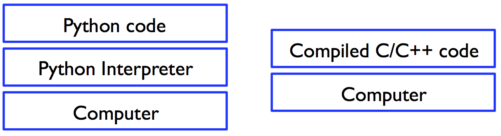
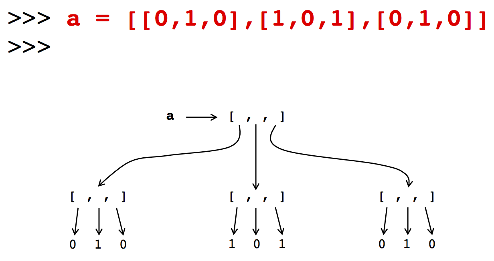

# CME 211 Lecture 10 - Numpy

## Motivation

### Python is kind of slow

One of the main disadvantages of a higher level language is that, while
comparatively easy to program, it is typically slow compared to C/C++, Fortran,
or other lower level languages



### Object overhead



## Options for better performance

* Python is great for quick projects, prototyping new ideas, etc.

* What if you need better performance?

* One option is to completely rewrite your program in something like C/C++

### Python C API

* Python has a C API which allows the use of compiled modules


* The actual implementation of `string.find()` can be viewed at:

http://svn.python.org/view/python/trunk/Objects/stringlib/fastsearch.h

### Python compiled modules

* Python code in a `.py` file is actually executed in a hybrid approach by a mix
  of the interpreter and compiled modules that come with Python


### Extension modules

* The same Python C API used by the developers of Python itself also allows
  other programmers to develop and build their own compiled extension modules

* These modules extend the functionality of Python with high performance
  implementations of common operations

* Other languages, such as C++ and Fortran, are also supported by using the C
  API

### NumPy, SciPy, matplotlib

* NumPy - multidimensional arrays and fundamental operations on them

* SciPy - Various math functionality (linear solvers, FFT, optimization, etc.)
  utilizing NumPy arrays

* matplotlib - plotting and data visualization

* None of these packages seek to clone MATLAB, if you want that try something
  like GNU Octave

### Python software stack


## NumPy

NumPy provides a numeric array object:

```python
import numpy as np
a = np.array([7, 42, -3])
print(a)
```

```python
a[1]
```

```python
a[1] = 19
a
```

### Arrays are not lists

```python
a[0] = "hello"
```

```python
a.append(8)
```

### NumPy arrays

* NumPy arrays contain **homogeneous** data (all elements must have same type)

* Size is fixed, i.e. you can't append or remove

### Data types

* Integers

  * 8, 16, 32, and 64 bit signed and unsigned (np.int8, np.uint8, etc.)

* Floating point

  * 32, 64, 128 bit (np.float32, np.float64, etc.)

* Complex, strings, and Python object references also supported

### Data type examples

```python
a = np.array([ 7, 19, -3], dtype=np.float32)
a
```

```python
a[0] = a[0]/0.
a
```

```python
b = np.array([4, 7, 19], dtype=np.int8)
b
```

```python
b[0] = 437
b
```

### Multidimensional arrays

* Arrays can have multiple dimensions called *axes*

* The number of *axes* is called the *rank*

* These terms come from the NumPy community and should not be confused with linear
  algebra terms for *rank*, etc.

### Multidimensional arrays

```python
a = np.array([(7, 19, -3), (4, 8, 17)], dtype=np.float64)
a
```

```python
a.ndim
```

```python
a.dtype
```

```python
a.shape
```

```python
a.size
```

### Internal representation


### Creating arrays

```python
a = np.empty((3,3))
a
```

```python
a = np.zeros((3,3))
a
```

```python
a = np.ones((3,3))
a
```

```python
a = np.eye(3)
a
```

```python
a = np.arange(9, dtype=np.float64)
a
```

```python
a = np.arange(9, dtype=np.float64).reshape(3,3)
a
```

### Reading data from a file

```sh
$ cat numbers.txt
7. 19. -3.
4. 8. 17.
```

```python
a = np.loadtxt('numbers.txt', dtype=np.float64)
a
```

```python
a = a + 1
np.savetxt('numbers2.txt', a)
```

### Remove single dimension entry

```python
a = np.arange(3)
a
```

```python
a.shape
b = np.arange(3).reshape(3,1)
print(b)
print(b.shape)
b = np.squeeze(b)
print(b)
print(b.shape)
```

### Array operations

```python
a = np.arange(9, dtype=np.float64)
a
```

```python
# a slice
a[3:7]
```

```python
# assign to a slice
a[3:7] = 0
a
```

```python
2*a
```

```python
a*a
```

```python
sum(a)
```

```python
min(a)
```

```python
max(a)
```

### Array operations

```python
a = np.arange(9, dtype=np.float64)
print(a)

# bad idea
total = 0.
for n in range(len(a)):
    total += a[n]*a[n]

math.sqrt(total)
```

```python
# better idea
import math
math.sqrt(np.dot(a,a))
```

```python
# best idea
np.linalg.norm(a)
```

### Speed of array operations

```python
%timeit total = sum(np.ones(1000000,dtype=np.int32))
```

```python
%timeit total = np.sum(np.ones(1000000,dtype=np.int32))
```

### Loops vs. array operations

* Loops you write in Python will be executed by the interpreter

* Some of the overloaded operators (e.g. `min`, `max`, `sum`, etc.) work albeit
  slowly

* Calling NumPy function or methods of the array object will invoke high
  performance implementations of these operations

### Matrix operations

```python
a = np.arange(9, dtype=np.float64).reshape(3,3)
a
```

```python
a.transpose()
```

```python
np.trace(a)
```

```python
a*a # element wise multiplication
```

```python
np.dot(a,a) # matrix-matrix multiplication
```

```python
# new matrix multiply operator in Python 3.5
a @ a
```

### array vs matrix

* NumPy has a dedicated matrix class

* However, the matrix class is not as widely used and there are subtle
  differences between a 2D array and a matrix

* It is highly recommended that you use 2D arrays for maximum compatibility with
  other NumPy functions, SciPy, matplotlib, etc.

* See here for more details:

<http://www.scipy.org/NumPy_for_Matlab_Users>

(`array' or `matrix'? Which should I use?)

### References to an array

```python
a = np.arange(9, dtype=np.float64).reshape(3,3)
a
```

```python
b = a
b[0,0] = 42
b
```

```python
a
```

### Array slices and references

```python
a = np.arange(9, dtype=np.float64)
a
```

```python
b = a[2:7]
b
```

```python
b[2] = -1
b
```

```python
a
```

### Array copies

```python
a = np.arange(9, dtype=np.float64)
a
```

```python
b = a.copy()
b
```

```python
b[4] = -1
b
```

```python
a
```

### Universal functions (ufuncs)

```python
import numpy
a = np.arange(9, dtype=np.float64)
a
```

```python
import math
math.sqrt(a)
```

```python
np.sqrt(a)
```

### Beyond just arrays


* NumPy has some support for some useful operations beyond the usual vector and
  matrix operations:

  * Searching, sorting, and counting within arrays

  * FFT (Fast Fourier Transform)

  * Linear Algebra

  * Statistics

  * Polynomials

  * Random number generation

* SciPy has largely replaced much of this functionality,
  plus added much more

### Warning

* Once you start making use of extension modules such as NumPy, SciPy, etc. the
  chances of code "breaking" when you run it on different machines goes up
  significantly

* If you do some of your development on machines other than corn (which isn't
  the model we advise) you may run into issues

### Further Reading

* MATLAB users: <http://www.scipy.org/NumPy_for_Matlab_Users>
* NumPy tutorial at: <http://www.scipy.org/Tentative_NumPy_Tutorial>
* Official docs at: <http://docs.scipy.org/>
