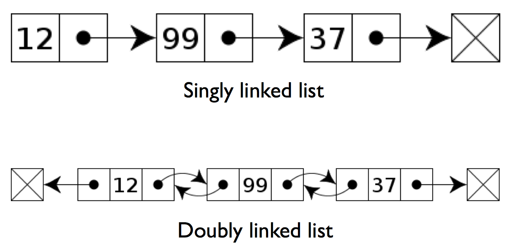

## Container iteration

### Container iteration example 1

`src/iter1.cpp`:

```cpp
#include <iostream>
#include <vector>

int main()
{
  std::vector<double> vec;

  vec.push_back(7);
  vec.push_back(11);
  vec.push_back(42);

  // Creates a copy v for each element in vec and increments the copy
  for (auto v : vec)
    ++v;

  // The original elements of the vector vec are unchanged
  for (auto v : vec)
    std::cout << v << std::endl;

  return 0;
}
```

Output:

```
$ clang++ -std=c++11 -Wall -Wextra -Wconversion src/iter1.cpp -o src/iter1
$ ./src/iter1
7
11
42
```

### Container iteration example 2

`src/iter2.cpp`:

```cpp
#include <iostream>
#include <vector>

int main()
{
  std::vector<double> vec;

  vec.push_back(7);
  vec.push_back(11);
  vec.push_back(42);

  // Creates a reference v to each element in vec and increments each element.
  for (auto& v : vec)
    ++v;

  // The original elements of the vector vec are incremented by one
  for (auto v : vec)
    std::cout << v << std::endl;

  return 0;
}
```

Output:

```
$ clang++ -std=c++11 -Wall -Wextra -Wconversion src/iter2.cpp -o src/iter2
$ ./src/iter2
8
12
43
```

## Map

* A C++ map is analogous to a dictionary in Python

* Need to specify data type for both the key and the value when instance is
declared

### Our first map

`src/map1.cpp`:

```cpp
#include <iostream>
#include <map>

int main()
{
  std::map<char,std::string> dir;

  dir['A'] = std::string("south");
  dir['B'] = std::string("north");
  dir['C'] = std::string("east");
  dir['D'] = std::string("west");

  std::cout << "dir[C] = " << dir['C'] << std::endl;
  std::cout << "dir[A] = " << dir['A'] << std::endl;

  return 0;
}
```

Output:

```
$ clang++ -std=c++11 -Wall -Wextra -Wconversion src/map1.cpp -o src/map1
$ ./src/map1
dir[C] = east
dir[A] = south
```

### Map iteration

`src/map2.cpp`:

```cpp
#include <iostream>
#include <map>

int main()
{
  // Define a map 'dir' with characters as keys and strings as values
  std::map<char,std::string> dir;

  dir['A'] = std::string("south");
  dir['B'] = std::string("north");
  dir['C'] = std::string("east");
  dir['D'] = std::string("west");

  // Printing by value
  for (auto d : dir)
  {
    std::cout << "d[" << d.first << "] = " << d.second << std::endl;
  }
  std::cout << std::endl;

  // Printing by reference
  for (auto& d : dir)
  {
      std::cout << "d[" << d.first << "] = " << d.second << std::endl;
  }

  return 0;
}
```

Output:

```
$ clang++ -std=c++11 -Wall -Wextra -Wconversion src/map2.cpp -o src/map2
$ ./src/map2
d[A] = south
d[B] = north
d[C] = east
d[D] = west

d[A] = south
d[B] = north
d[C] = east
d[D] = west
```

### Older style iteration

`src/map3.cpp`:

```cpp
#include <iostream>
#include <map>

int main()
{
  std::map<char,std::string> dir;

  dir['A'] = std::string("south");
  dir['B'] = std::string("north");
  dir['C'] = std::string("east");
  dir['D'] = std::string("west");

  // C++03 standard map iteration
  // This is more cumbersome, but shows better what is going on inside the loop.
  for (std::map<char,std::string>::iterator i = dir.begin(); i != dir.end(); i++)
    std::cout << "d[" << i->first << "] = " << i->second << std::endl;

  return 0;
}
```

Output:

```
$ clang++ -std=c++11 -Wall -Wextra -Wconversion src/map3.cpp -o src/map3
$ ./src/map3
d[A] = south
d[B] = north
d[C] = east
d[D] = west
```

### Nonexistent keys

`src/map4.cpp`:

```cpp
#include <iostream>
#include <map>

int main()
{
  std::map<char, std::string> dir;

  dir['A'] = std::string("north");
  dir['B'] = std::string("east");
  dir['C'] = std::string("south");
  dir['D'] = std::string("west");

  // Map size = 4
  std::cout << "dir.size() = " << dir.size() << std::endl;

  // Try to access value with key 'G' (creates new map entry with key 'G').
  std::cout << "dir[G] = "     << dir['G']     << std::endl;

  // Map size = 5
  std::cout << "dir.size() = " << dir.size() << std::endl;
  
  return 0;
}
```

Output:

```
$ clang++ -std=c++11 -Wall -Wextra -Wconversion src/map4.cpp -o src/map4
$ ./src/map4
dir.size() = 4
dir[5] =
dir.size() = 5
```

### Nonexistent keys

`src/map5.cpp`:

```cpp
#include <iostream>
#include <map>

int main()
{
  std::map<char, std::string> dir;

  dir['A'] = std::string("north");
  dir['B'] = std::string("east");
  dir['C'] = std::string("south");
  dir['D'] = std::string("west");

  // Map size = 4
  std::cout << "dir.size() = " << dir.size() << std::endl;

  // Throws an exception -- out of range
  std::cout << "dir[G] = "     << dir.at('G')     << std::endl;
  
  return 0;
}
```

Output:

```
$ clang++ -std=c++11 -Wall -Wextra -Wconversion src/map5.cpp -o src/map5
$ ./src/map5
dir.size() = 4
dir.at(5) =
libc++abi.dylib: terminating with uncaught exception of type std::out_of_range:
map::at:  key not found
```

### Testing for a key

`src/map6.cpp`:

```cpp
#include <iostream>
#include <map>

int main()
{
  std::map<char, std::string> dir;

  dir['A'] = std::string("north");
  dir['B'] = std::string("east");
  dir['C'] = std::string("south");
  dir['D'] = std::string("west");

  std::cout << "dir.count(A) = " << dir.count('A') << std::endl;
  std::cout << "dir.count(G) = " << dir.count('G') << std::endl;

  return 0;
}
```

Output:

```
$ clang++ -std=c++11 -Wall -Wextra -Wconversion src/map6.cpp -o src/map6
$ ./src/map6
dir.count(A) = 1
dir.count(G) = 0
```

### Testing for a key

`src/map7.cpp`:

```cpp
#include <iostream>
#include <map>

int main() {
  std::map<char, std::string> dir;

  dir['A'] = std::string("north");
  dir['B'] = std::string("east");
  dir['C'] = std::string("south");
  dir['D'] = std::string("west");

  char key = 'C';
  auto iter = dir.find(key);
  if (iter == dir.end()) {
    std::cout << "key " << key << " is not present" << std::endl;
  }
  else {
    std::cout << "key " << key << " is present" << std::endl;
    std::cout << "value is " << iter->second << std::endl;
  }

  return 0;
}
```

Output:

```
$ clang++ -std=c++11 -Wall -Wextra -Wconversion src/map7.cpp -o src/map7
$ ./src/map7
key C is present
value is south
```

### Key order

`src/map8.cpp`:

```cpp
#include <iostream>
#include <map>

int main()
{
  std::map<char,std::string> dir;

  dir['C'] = std::string("south");
  dir['D'] = std::string("west");
  dir['B'] = std::string("east");
  dir['A'] = std::string("north");

  for (auto& d : dir)
    std::cout << d.first << std::endl;

  return 0;
}
```

Output:

```
$ clang++ -std=c++11 -Wall -Wextra -Wconversion src/map8.cpp -o src/map8
$ ./src/map8
A
B
C
D
```

### Map and tuples

`src/map9.cpp`:

```cpp
#include <fstream>
#include <iostream>
#include <map>
#include <string>
#include <tuple>

int main() {
  // Open file and check if successful, print error message if it fails
  std::ifstream f("../dist.female.first");
  if (not f.good()) {
    std::cerr << "ERROR: Failed to open file" << std::endl;
    return 1;
  }

  // Create map 'names'
  std::map<std::string, std::tuple<double, double, int> > names;

  // Load file entries into the map
  std::string name;
  double perc1, perc2;
  int rank;
  while(f >> name >> perc1 >> perc2 >> rank) {
    names[name] = std::make_tuple(perc1, perc2, rank);
  }

  // Read from the map and print on std output
  // Method std::get<0>() gets 0th element of the tuple
  // The template parameter <0> must be a literal!
  for(auto& data : names) {
    std::cout << data.first << " " << std::get<2>(data.second) << std::endl;
  }

  return 0;
}
```

File `dist.female.first`:

```
MARY           2.629  2.629      1
PATRICIA       1.073  3.702      2
LINDA          1.035  4.736      3
BARBARA        0.980  5.716      4
ELIZABETH      0.937  6.653      5
JENNIFER       0.932  7.586      6
MARIA          0.828  8.414      7
TERRY          0.794  9.209      8
MARGARET       0.768  9.976      9
DOROTHY        0.727 10.703     10
```

Output:

```
$ clang++ -std=c++11 -Wall -Wextra -Wconversion src/map9.cpp -o src/map9
$ ./src/map9
BARBARA 4
DOROTHY 10
ELIZABETH 5
JENNIFER 6
LINDA 3
MARGARET 9
MARIA 7
MARY 1
PATRICIA 2
TERRY 8
```


### Using functions

`src/readnames.hpp`:

```cpp
#ifndef READNAMES_HPP
#define READNAMES_HPP

#include <map>
#include <string>
#include <tuple>

std::map<std::string,std::tuple<double,double,int>> ReadNames(std::string filename);

#endif /* READNAMES_HPP */
```

`src/readnames.cpp`:

```cpp
#include <fstream>
#include <iostream>

#include "readnames.hpp"

std::map<std::string,std::tuple<double,double,int>> ReadNames(std::string filename)
{
  // Create file I/O stream
  std::ifstream f(filename);

  // Create map 'names'
  std::map<std::string,std::tuple<double,double,int> > names;

  std::string name;
  double perc1, perc2;
  int rank;
  // Read file entries and store them into the map 'names'
  while(f >> name >> perc1 >> perc2 >> rank) {
    names[name] = std::make_tuple(perc1, perc2, rank);
  }

  // Return map 'filename' by value
  return names;
}
```

`#pragma once`: only include this file once (not standard)

`src/testname.hpp`:

```cpp
#pragma once

#include <map>
#include <string>
#include <tuple>

double TestName(std::map<std::string,std::tuple<double,double,int>> names,
                std::string name);
```

`src/testname.cpp`:

```cpp
#include <iostream>

#include "testname.hpp"

double TestName(std::map<std::string,std::tuple<double,double,int>> names,
                std::string name)
{
  // Variable to store name rank
  int name_rank = 0;

  // The variable 'match' is a map iterator. Function 'find(mapKey)' returns
  // the iterator that points to the map entry with key value 'mapKey'
  auto match = names.find(name);

  // Check if the iterator returns end value (i.e. 'mapKey' is not in the map).
  // If not, read the name rank for the 'name'.
  if (match != names.end())
  {
    // The name rank is the third entry (index 2) in the tuple 'match->second'.
    // It is retrieved by calling std::get<2> function.
    name_rank = std::get<2>(match->second);
  }

  return name_rank;
}
```

### Using functions

`src/main.cpp`:

```cpp
#include <iostream>
#include <string>
#include <vector>

#include "readnames.hpp"
#include "testname.hpp"

int main()
{
  // Read file and store its data in object 'names'.
  // Let compiler find the type of the object.
  auto names = ReadNames("../dist.female.first");

  // Create a vector of strings. 
  std::vector<std::string> tests;
  tests.push_back("LINDA");
  tests.push_back("PETER");
  tests.push_back("DOROTHY");

  // Check for each name in the vector if it is stored in object 'names'.
  // If the name is found in object 'names' print its rank, otherwise print zero.
  for(auto test : tests)
  {
    std::cout << test << " " << TestName(names, test) << std::endl;
  }

  return 0;
}
```

Output:

```
$ clang++ -std=c++11 -Wall -Wextra -Wconversion src/main.cpp src/readnames.cpp \
$ src/testname.cpp -o src/main
$ ./src/main
LINDA 3
PETER 0
DOROTHY 10
```

### Sets

`src/set.cpp`:

```cpp
#include <algorithm>
#include <fstream>
#include <iostream>
#include <set>
#include <string>

// Open file and copy its content into a set of strings
std::set<std::string> ReadNames(std::string filename)
{
  // Create a set of strings
  std::set<std::string> names;

  std::ifstream f(filename);
  if (not f.is_open())
  {
    std::cerr << "ERROR: Could not read file " << filename << std::endl;
    return names;
  }

  std::string name;
  double perc1, perc2;
  int rank;
  // Read file
  while (f >> name >> perc1 >> perc2 >> rank)
  {
    // Insert 'name' into the set, throw away other stuff
    names.insert(name);
  }
  f.close();

  // Return set of strings
  return names;
}

int main()
{
  // Create set of female names
  auto fnames = ReadNames("../dist.female.first");
  // Create set of male names
  auto mnames = ReadNames("../dist.male.first");

  // Create set of strings 'common' to store the intersection
  std::set<std::string> common; // Default constructor

  // For more algorithms see http://en.cppreference.com/w/cpp/algorithm
  // Here we use set intersection algorithm:
  std::set_intersection(fnames.begin(), 
                        fnames.end(), 
                        mnames.begin(), 
                        mnames.end(),
                        std::inserter(common, common.begin()));

  // std::inserter(c, i) function template is used to inserts an element
  // into container c at the iterator position i.
  // Returns std::insert_iterator
  // See: http://en.cppreference.com/w/cpp/iterator/inserter

  std::cout << fnames.size() << " female names" << std::endl;
  std::cout << mnames.size() << " male names"   << std::endl;
  std::cout << common.size() << " common names" << std::endl;

  return 0;
}
```

The file `dist.female.names` is the same file used in the `map9.cpp` example.
The file `dist.male.names` looks like this:
```
JUSTIN         0.311 49.040     56
TERRY          0.311 49.351     57
GERALD         0.309 49.660     58
KEITH          0.308 49.968     59
SAMUEL         0.306 50.274     60
WILLIE         0.302 50.576     61
RALPH          0.282 50.859     62
LAWRENCE       0.282 51.141     63
NICHOLAS       0.275 51.415     64
ROY            0.273 51.688     65
```


Output:

```
$ clang++ -std=c++11 -Wall -Wextra -Wconversion src/set.cpp -o src/set
$ ./src/set
10 female names
10 male names
1 common names
```

### Additional data structures

* `std::array` (C++ 2011)

* `std::list`

* `std::forward_list` (C++ 2011)

* `std::unordered_map` (C++ 2011)

* `std::unordered_set` (C++ 2011)

### Array example

`src/array.cpp`:

```cpp
#include <array>
#include <iostream>

int main()
{
  std::array<double,4> a;

  a.fill(1.);
  a[2] = 3.;

  for (auto val : a)
    std::cout << val << std::endl;

  return 0;
}
```

Output:

```
$ clang++ -std=c++11 -Wall -Wextra -Wconversion src/array.cpp -o src/array
$ ./src/array
1
1
3
1
```

## Linked lists

* Ordered data sequence similar to a C++ vector or Python list, but data is not
stored contiguously

* Sense of order is maintained via links

* There is additional storage overhead for the links

* But this allows for insertion and removal operations in constant time



### List example

`src/list.cpp`:

```cpp
#include <iostream>
#include <list>

int main()
{
  // Create and populate list 'lst'.
  std::list<int> lst;
  lst.push_back(42);
  lst.push_back(17);
  lst.push_back(9);
  lst.push_front(18);

  // Print elements of the list.
  std::cout << "Elements of the list:\n";
  for (auto& val : lst)
    std::cout << val << std::endl;
  std::cout << "\n";

  // Create a list iterator and set it to the beginning of the list.
  auto it = lst.begin();

  // Advance list iterator to the third element of the list and erase it.
  // (remember 0-based indexing).
  advance(it, 2);
  std::cout << "Erasing element " << *it << " ... \n"; 
  //   Dereference 'it' to get value ^^^
  lst.erase(it);
  std::cout << "\n";

  // Print elements of the list again to see the modified list.
  std::cout << "Elements of the list:\n";
  for (auto val : lst)
    std::cout << val << std::endl;
  std::cout << "\n";

  return 0;
}
```

```
$ clang++ -std=c++11 -Wall -Wextra -Wconversion src/list.cpp -o src/list
$ ./src/list
Elements of the list:
18
42
17
9

Erasing element 17 ... 

Elements of the list:
18
42
9
```


### Maps and sets

* Python dictionaries and sets are internally implemented by using hashing

* For hashing implementation, time complexity for data access is (amortized)
constant time

* Instances of C++ `std::map` and `std::set` are internally implemented using a tree
data structure

* For a tree, time complexity for data access is `O(log n)`

* Reference: <http://www.cplusplus.com/reference/map/map/operator[]/>

### Unordered maps and sets

* In the C++ 2011 standard the `std::unordered_map` and `set::unordered_set`
were added

* Like Python, internal implementation is based on hashing

* Faster access, but entries are no longer ordered (but that usually doesn't
  matter)

### Unordered map example

`src/unordered_map.cpp`:

```cpp
#include <iostream>
#include <unordered_map>

int main()
{
  std::unordered_map<int,std::string> dir;

  dir[0] = std::string("north");
  dir[1] = std::string("east");
  dir[2] = std::string("south");
  dir[3] = std::string("west");

  std::cout << "dir[2] = " << dir[2] << std::endl;
  std::cout << "dir[0] = " << dir[0] << std::endl;

  return 0;
}
```

Output:

```
$ clang++ -std=c++11 -Wall -Wextra -Wconversion src/unordered_map.cpp -o src/unordered_map
$ ./src/unordered_map
dir[2] = south
dir[0] = north
```

## Reading

* **C++ Primer, Fifth Edition** by Lippman et al.

* Chapter 11: Associative Containers: Sections 11.1 - 11.3
