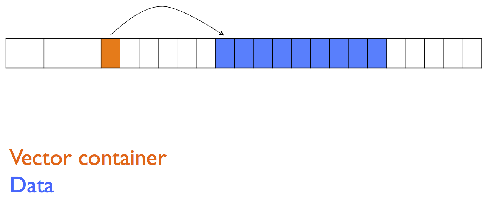

# CME 211: Lecture 21

Wednesday, November 11, 2015

Topics:

* Multi-dimensional data
* Boost `multi_array`

## Layout in memory for `vector`



* Memory for `std::vector` has 2 parts:

  * Memory for the vector data

  * Memory for the `std::vector` container.  This part (essentially) includes
  the memory address of the vector data, the size of the vector and capacity.

* The 2 parts may be very far apart in the memory address space.

### Look at the details

`src/vector_memory.cpp`:

```cpp
#include <iostream>
#include <vector>

int main() {
  std::vector<int> a;
  for (int i = 0; i < 10; i++) {
    a.push_back(i);
  }
  std::cout << "sizeof(a): " << sizeof(a) << std::endl;
  std::cout << "    memory location of a: " << &a << std::endl;
  std::cout << " memory location of data: " << a.data() << std::endl;
  std::cout << "difference in memory loc: "
            << double((int*)&a-a.data()) / 1024 / 1024 / 1024 
            << " GB" << std::endl;
  return 0;
}
```

Output:

```
$ clang++ -std=c++11 -Wall -Wextra -Wconversion src/vector_memory.cpp -o src/vector_memory
$ ./src/vector_memory
sizeof(a): 24
    memory location of a: 0x7fff541738e0
 memory location of data: 0x7f9d4b500040
difference in memory loc: 98.0343 GB
$ ./src/vector_memory
sizeof(a): 24
    memory location of a: 0x7fff5d1498e0
 memory location of data: 0x7ffddac04ad0
difference in memory loc: 1.5091 GB
$ ./src/vector_memory
sizeof(a): 24
    memory location of a: 0x7fff5b5a88e0
 memory location of data: 0x7ffcc2c04ad0
difference in memory loc: 2.5961 GB
```

* The size of the `std::vector` container is 24 bytes, this could be for

  * 8 bytes for the memory address of the vector data

  * 8 bytes for the size of the vector, number of elements stored

  * 8 bytes of the capacity of the vector, number of elements that may be stored
  before reallocation
  
* Memory locations are different in each run of the program.  This is a security
  feature to make it harder to introduce malicious code or data.
  
## Multidimensional data

* How do we handle multidimensional data in C++?

### Container of containers

`src/multi1.cpp`:

```cpp
#include <vector>
#include <iostream>

int main() {
  // declare vector of vectors
  std::vector< std::vector<double> > v;
  // add empty "second-level" vectors
  v.push_back(std::vector<double>());
  v.push_back(std::vector<double>());
  v.push_back(std::vector<double>());
  // add some data
  double n = 0.;
  for(unsigned int i = 0; i < 3; i++) {
    for(unsigned int j = 0; j < 3; j++) {
      v[i].push_back(n);
      n++;
    }
  }
  // print
  for(unsigned int i = 0; i < 3; i++) {
    for(unsigned int j = 0; j < 3; j++) {
      std::cout << "v[" << i << "][" << j << "] = " << v[i][j] << std::endl;
    }
  }
  return 0;
}
```

Output:

```
$ clang++ -std=c++11 -Wall -Wextra -Wconversion src/multi1.cpp -o src/multi1
$ ./src/multi1
v[0][0] = 0
v[0][1] = 1
v[0][2] = 2
v[1][0] = 3
v[1][1] = 4
v[1][2] = 5
v[2][0] = 6
v[2][1] = 7
v[2][2] = 8
```

### Layout in memory


### Contiguous memory

`src/multi2.cpp`:

```cpp
#include <iostream>
#include <vector>

int main() {
  unsigned int nrows = 3, ncols = 3;
  std::vector<double> a;
  a.resize(nrows*ncols);

  double n = 0.;
  for(unsigned int i = 0; i < nrows; i++) {
    for(unsigned int j = 0; j < ncols; j++) {
      // manual indexing into "multi-dimensional array"
      a[i*ncols + j] = n;
      n++;
    }
  }

  for(unsigned int i = 0; i < nrows*ncols; i++) {
    std::cout << "a[" << i << "] = " << a[i] << std::endl;
  }
  return 0;
}
```

Output:

```
$ clang++ -std=c++11 -Wall -Wextra -Wconversion src/multi2.cpp -o src/multi2
$ ./src/multi2
a[0] = 0
a[1] = 1
a[2] = 2
a[3] = 3
a[4] = 4
a[5] = 5
a[6] = 6
a[7] = 7
a[8] = 8
```

## Boost Multidimensional Array Library

`src/array1.cpp`:

```cpp
#include <iostream>
#include <boost/multi_array.hpp>

int main() {
  unsigned int nrows = 3, ncols = 3;
  boost::multi_array<double, 2> a(boost::extents[nrows][ncols]);

  double n = 0.;
  for (unsigned int i = 0; i < nrows; i++) {
    for (unsigned int j = 0; j < ncols; j++) {
      a[i][j] = n; // access elements like static array
      n++;
    }
  }

  for (unsigned int i = 0; i < nrows; i++) {
    for (unsigned int j = 0; j < ncols; j++) {
      std::cout << "a[" << i << "][" << j << "] = " << a[i][j] << std::endl;
    }
  }
  return 0;
}
```

Output:

```
$ clang++ -std=c++11 -Wall -Wextra -Wconversion src/array1.cpp -o src/array1
$ ./src/array1
a[0][0] = 0
a[0][1] = 1
a[0][2] = 2
a[1][0] = 3
a[1][1] = 4
a[1][2] = 5
a[2][0] = 6
a[2][1] = 7
a[2][2] = 8
```

### Accessing the contiguous memory

`src/array2.cpp`:

```cpp
#include <iostream>

#include <boost/multi_array.hpp>

int main() {
  boost::multi_array<double, 2> a(boost::extents[3][3]);

  double n = 0.;
  for (unsigned int i = 0; i < 3; i++) {
    for (unsigned int j = 0; j < 3; j++) {
      a[i][j] = n;
      n++;
    }
  }

  for (unsigned int n = 0; n < a.num_elements(); n++) {
    std::cout << "a.data()[" << n << "] = " << a.data()[n] << std::endl;
  }

  return 0;
}
```

Output:

```
$ clang++ -std=c++11 -Wall -Wextra -Wconversion src/array2.cpp -o src/array2
$ ./src/array2
a.data()[0] = 0
a.data()[1] = 1
a.data()[2] = 2
a.data()[3] = 3
a.data()[4] = 4
a.data()[5] = 5
a.data()[6] = 6
a.data()[7] = 7
a.data()[8] = 8
```

### Performance

`src/perf1.cpp`:

```cpp
#include <iostream>
#include <ctime>
#include <boost/multi_array.hpp>

int main() {
  unsigned int nrows = 8192, ncols = 8192;
  boost::multi_array<double, 2> a(boost::extents[nrows][ncols]);

  for (unsigned int i = 0; i < nrows; i++) {
    for (unsigned int j = 0; j < ncols; j++) {
      a[i][j] = 1.0;
    }
  }
  
  auto t0 = std::clock();
  double sum = 0.;
  for (unsigned int i = 0; i < nrows; i++) {
    for (unsigned int j = 0; j < ncols; j++) {
      sum += a[i][j];
    }
  }
  auto t1 = std::clock();

  std::cout << " boost: sum = " << sum << ", time = "
            << double(t1-t0) / CLOCKS_PER_SEC
            << " seconds"<< std::endl;

  auto b = a.data();
  t0 = std::clock();
  sum = 0.;
  for (unsigned int n = 0; n < nrows*ncols; n++) {
    sum += b[n];
  }
  t1 = std::clock();
  std::cout << "direct: sum = " << sum << ", time = "
            << double(t1-t0) / CLOCKS_PER_SEC
            << " seconds"<< std::endl;
  return 0;
}
```

Output:

```
$ clang++ -std=c++11 -Wall -Wextra -Wconversion src/perf1.cpp -o src/perf1
$ ./src/perf1
 boost: sum = 6.71089e+07, time = 4.4801 seconds
direct: sum = 6.71089e+07, time = 0.1854 seconds
$ ./src/perf1
 boost: sum = 6.71089e+07, time = 4.4333 seconds
direct: sum = 6.71089e+07, time = 0.186353 seconds
$ ./src/perf1
 boost: sum = 6.71089e+07, time = 4.39778 seconds
direct: sum = 6.71089e+07, time = 0.184639 seconds
```

### Performance

From `src/perf2.cpp`:

```c++
// disable boost range checking
#define BOOST_DISABLE_ASSERTS
#include <boost/multi_array.hpp>
```
Output:

```
$ clang++ -std=c++11 -Wall -Wextra -Wconversion src/perf2.cpp -o src/perf2
$ ./src/perf2
 boost: sum = 6.71089e+07, time = 3.97609 seconds
direct: sum = 6.71089e+07, time = 0.184989 seconds
$ ./src/perf2
 boost: sum = 6.71089e+07, time = 3.97695 seconds
direct: sum = 6.71089e+07, time = 0.18614 seconds
$ ./src/perf2
 boost: sum = 6.71089e+07, time = 3.97976 seconds
direct: sum = 6.71089e+07, time = 0.184732 seconds
```

### Compiler optimization

Enable compiler optimizations with the `-O3` argument.

With range checking:

Output:

```
$ clang++ -O3 -std=c++11 -Wall -Wextra -Wconversion src/perf1.cpp -o src/perf1
$ ./src/perf1
 boost: sum = 6.71089e+07, time = 0.064458 seconds
direct: sum = 6.71089e+07, time = 0.064259 seconds
$ ./src/perf1
 boost: sum = 6.71089e+07, time = 0.068965 seconds
direct: sum = 6.71089e+07, time = 0.064744 seconds
$ ./src/perf1
 boost: sum = 6.71089e+07, time = 0.066465 seconds
direct: sum = 6.71089e+07, time = 0.062854 seconds
```

Range checking disabled:

Output:

```
$ clang++ -O3 -std=c++11 -Wall -Wextra -Wconversion src/perf2.cpp -o src/perf2
$ ./src/perf2
 boost: sum = 6.71089e+07, time = 0.065588 seconds
direct: sum = 6.71089e+07, time = 0.067835 seconds
$ ./src/perf2
 boost: sum = 6.71089e+07, time = 0.065887 seconds
direct: sum = 6.71089e+07, time = 0.071683 seconds
$ ./src/perf2
 boost: sum = 6.71089e+07, time = 0.064704 seconds
direct: sum = 6.71089e+07, time = 0.062087 seconds
```

### Range checking

`src/array3a.cpp`:

```cpp
#include <iostream>
#include <boost/multi_array.hpp>

int main() {
  boost::multi_array<double, 2> a(boost::extents[3][3]);
  a[3][3] = 1.;
  return 0;
}
```

Output:

```
$ clang++ -std=c++11 -Wall -Wextra -Wconversion src/array3a.cpp -o src/array3a
$ ./src/array3a
Assertion failed: (size_type(idx - index_bases[0]) < extents[0]), function access, file /usr/local/include/boost/multi_array/base.hpp, line 136.
```

### Range checking

`src/array3b.cpp`:

```cpp
#include <iostream>
#define BOOST_DISABLE_ASSERTS
#include <boost/multi_array.hpp>

int main() {
  boost::multi_array<double, 2> a(boost::extents[3][3]);
  a[3][3] = 1.;
  return 0;
}
```

Output:

```
$ clang++ -std=c++11 -Wall -Wextra -Wconversion src/array3b.cpp -o src/array3b
$ ./src/array3b
$ clang++ -std=c++11 -g -fsanitize=address -Wall -Wextra -Wconversion src/array3b.cpp -o src/array3b
$ ./src/array3b
=================================================================
==22629==ERROR: AddressSanitizer: heap-buffer-overflow on address 0x60700000dd00 at pc 0x00010a53d131 bp 0x7fff556c3710 sp 0x7fff556c3708
WRITE of size 8 at 0x60700000dd00 thread T0
==22629==atos returned: An admin user name and password is required to enter Developer Mode.
    #0 0x10a53d130 in main (/Users/nwh/Dropbox/courses/2015-Q4-cme211/lecture-prep/lecture-21-work/./src/array3b+0x100001130)
    #1 0x7fff9147f5c8 in start (/usr/lib/system/libdyld.dylib+0x35c8)
    #2 0x0  (<unknown module>)

0x60700000dd00 is located 16 bytes to the left of 67-byte region [0x60700000dd10,0x60700000dd53)
allocated by thread T0 here:
    #0 0x10a591bb0 in wrap_malloc (/Applications/Xcode.app/Contents/Developer/Toolchains/XcodeDefault.xctoolchain/usr/lib/clang/7.0.0/lib/darwin/libclang_rt.asan_osx_dynamic.dylib+0x42bb0)
    #1 0x7fff83776441 in _xpc_malloc (/usr/lib/system/libxpc.dylib+0x2441)
    #2 0x7fff8377631d in _xpc_dictionary_insert (/usr/lib/system/libxpc.dylib+0x231d)
    #3 0x7fff83778a95 in xpc_dictionary_set_string (/usr/lib/system/libxpc.dylib+0x4a95)
    #4 0x7fff83778993 in _xpc_collect_environment (/usr/lib/system/libxpc.dylib+0x4993)
    #5 0x7fff83775acb in _libxpc_initializer (/usr/lib/system/libxpc.dylib+0x1acb)
    #6 0x7fff902d4a94 in libSystem_initializer (/usr/lib/libSystem.B.dylib+0x1a94)
    #7 0x7fff6f3e1d0a  (<unknown module>)
    #8 0x7fff6f3e1e97  (<unknown module>)
    #9 0x7fff6f3de890  (<unknown module>)
    #10 0x7fff6f3de825  (<unknown module>)
    #11 0x7fff6f3de825  (<unknown module>)
    #12 0x7fff6f3de825  (<unknown module>)
    #13 0x7fff6f3de717  (<unknown module>)
    #14 0x7fff6f3de988  (<unknown module>)
    #15 0x7fff6f3d1244  (<unknown module>)
    #16 0x7fff6f3d4c18  (<unknown module>)
    #17 0x7fff6f3d0275  (<unknown module>)
    #18 0x7fff6f3d0035  (<unknown module>)
    #19 0x0  (<unknown module>)

SUMMARY: AddressSanitizer: heap-buffer-overflow ??:0 main
Shadow bytes around the buggy address:
  0x1c0e00001b50: fa fa fa fa fa fa fa fa fa fa fa fa fa fa fa fa
  0x1c0e00001b60: fa fa fa fa fa fa fa fa fa fa fa fa fa fa fa fa
  0x1c0e00001b70: fa fa fa fa fa fa fa fa fa fa fa fa fa fa fa fa
  0x1c0e00001b80: fa fa fa fa fa fa fa fa fa fa fa fa fa fa fa fa
  0x1c0e00001b90: fa fa fa fa 00 00 00 00 00 00 00 00 00 fa fa fa
=>0x1c0e00001ba0:[fa]fa 00 00 00 00 00 00 00 00 03 fa fa fa fa fa
  0x1c0e00001bb0: 00 00 00 00 00 00 00 00 00 fa fa fa fa fa 00 00
  0x1c0e00001bc0: 00 00 00 00 00 00 00 00 fa fa fa fa fd fd fd fd
  0x1c0e00001bd0: fd fd fd fd fd fd fa fa fa fa fd fd fd fd fd fd
  0x1c0e00001be0: fd fd fd fd fa fa fa fa fd fd fd fd fd fd fd fd
  0x1c0e00001bf0: fd fd fa fa fa fa fd fd fd fd fd fd fd fd fd fd
Shadow byte legend (one shadow byte represents 8 application bytes):
  Addressable:           00
  Partially addressable: 01 02 03 04 05 06 07 
  Heap left redzone:       fa
  Heap right redzone:      fb
  Freed heap region:       fd
  Stack left redzone:      f1
  Stack mid redzone:       f2
  Stack right redzone:     f3
  Stack partial redzone:   f4
  Stack after return:      f5
  Stack use after scope:   f8
  Global redzone:          f9
  Global init order:       f6
  Poisoned by user:        f7
  Container overflow:      fc
  Array cookie:            ac
  Intra object redzone:    bb
  ASan internal:           fe
  Left alloca redzone:     ca
  Right alloca redzone:    cb
==22629==ABORTING
```

### Range checking

Another method to check for memory leaks is `valgrind`.

Output:

```
$ clang++ -g -Wall -Wextra -Wconversion src/array3b.cpp -o src/array3b
$ valgrind ./src/array3b
==22635== Memcheck, a memory error detector
==22635== Copyright (C) 2002-2015, and GNU GPL'd, by Julian Seward et al.
==22635== Using Valgrind-3.11.0 and LibVEX; rerun with -h for copyright info
==22635== Command: ./src/array3b
==22635== 
==22635== Invalid write of size 8
==22635==    at 0x10000093D: main (array3b.cpp:7)
==22635==  Address 0x100809650 is 16 bytes after a block of size 80 in arena "client"
==22635== 
==22635== 
==22635== HEAP SUMMARY:
==22635==     in use at exit: 34,725 bytes in 422 blocks
==22635==   total heap usage: 510 allocs, 88 frees, 41,197 bytes allocated
==22635== 
==22635== LEAK SUMMARY:
==22635==    definitely lost: 0 bytes in 0 blocks
==22635==    indirectly lost: 0 bytes in 0 blocks
==22635==      possibly lost: 0 bytes in 0 blocks
==22635==    still reachable: 0 bytes in 0 blocks
==22635==         suppressed: 34,725 bytes in 422 blocks
==22635== 
==22635== For counts of detected and suppressed errors, rerun with: -v
==22635== ERROR SUMMARY: 1 errors from 1 contexts (suppressed: 0 from 0)
```

### Elementwise comparison

`src/array5.cpp`:

```cpp
#include <iostream>
#include <boost/multi_array.hpp>

int main() {
  boost::multi_array<double, 2> a(boost::extents[3][3]);
  boost::multi_array<double, 2> b(boost::extents[3][3]);

  for (unsigned int i = 0; i < 3; i++) {
    for (unsigned int j = 0; j < 3; j++) {
      a[i][j] = 1.;
      b[i][j] = 2.;
    }
  }

  std::cout << "a == b: " << (a == b) << std::endl;
  std::cout << "a < b: " << (a < b) << std::endl;
  std::cout << "a > b: " << (a > b) << std::endl;

  return 0;
}
```

Output:

```
$ clang++ -std=c++11 -Wall -Wextra -Wconversion src/array5.cpp -o src/array5
$ ./src/array5
a == b: 0
a < b: 1
a > b: 0
```

### Copy or reference?

`src/array6a.cpp`:

```cpp
#include <iostream>
#include <boost/multi_array.hpp>

int main() {
  boost::multi_array<double, 2> a(boost::extents[3][3]);

  for (unsigned int i = 0; i < 3; i++) {
    for (unsigned int j = 0; j < 3; j++) {
      a[i][j] = 1.;
    }
  }

  auto b = a; // copy or reference?

  for (unsigned int i = 0; i < 3; i++) {
    for (unsigned int j = 0; j < 3; j++) {
      a[i][j] = 2.;
    }
  }

  std::cout << "a b" << std::endl;
  std::cout << "---" << std::endl;
  for (unsigned int i = 0; i < 3; i++) {
    for (unsigned int j = 0; j < 3; j++) {
      std::cout << a[i][j] << " " << b[i][j] << std::endl;
    }
  }
  return 0;
}
```

Output:

```
$ clang++ -std=c++11 -Wall -Wextra -Wconversion src/array6a.cpp -o src/array6a
$ ./src/array6a
a b
---
2 1
2 1
2 1
2 1
2 1
2 1
2 1
2 1
2 1
```

### Passing an array to a function

`src/array6b.cpp`:

```cpp
#include <iostream>
#include <boost/multi_array.hpp>

void increment(boost::multi_array<double, 2> b) {
  for (unsigned int i = 0; i < 3; i++) {
    for (unsigned int j = 0; j < 3; j++) {
      b[i][j]++;
    }
  }
}

int main() {
  boost::multi_array<double, 2> a(boost::extents[3][3]);

  for (unsigned int i = 0; i < 3; i++) {
    for (unsigned int j = 0; j < 3; j++) {
      a[i][j] = 1.;
    }
  }

  increment(a);

  for (unsigned int i = 0; i < 3; i++) {
    for (unsigned int j = 0; j < 3; j++) {
      std::cout << a[i][j] << std::endl;
    }
  }
  return 0;
}
```

Output:

```
$ clang++ -std=c++11 -Wall -Wextra -Wconversion src/array6b.cpp -o src/array6b
$ ./src/array6b
1
1
1
1
1
1
1
1
1
```

### Passing by reference

From `src/array6c.cpp`:

```cpp
void increment(boost::multi_array<double, 2>& b) {
  for (unsigned int i = 0; i < 3; i++) {
    for (unsigned int j = 0; j < 3; j++) {
      b[i][j]++;
    }
  }
}
```

Output:

```
$ clang++ -std=c++11 -Wall -Wextra -Wconversion src/array6b.cpp -o src/array6b
$ ./src/array6b
1
1
1
1
1
1
1
1
1
```

### Array operations?

* Boost `multi_array` does not support array operations like NumPy

* If `a` is a `multi_array` things like `2*a` and `a = 1.0` will not work and
will lead to very long compiler error messages.

* If you want this kind of stuff, have a look at:

  * http://eigen.tuxfamily.org/index.php?title=Main_Page

  * http://arma.sourceforge.net/

### Array views

An **array view** is essentially a reference into a sub-array of a larger array.

`src/array9.cpp`:

```cpp
#include <iostream>
#include <boost/multi_array.hpp>

int main() {
  boost::multi_array<double, 2> a(boost::extents[3][3]);

  double n = 0.;
  for (unsigned int i = 0; i < 3; i++) {
    for (unsigned int j = 0; j < 3; j++) {
      a[i][j] = n;
      n++;
    }
  }

  /* Setup b as a view into a subset of a. */
  typedef boost::multi_array<double, 2>::index_range index_range;
  auto b = a[boost::indices[index_range(1,3)][index_range(1,3)]];

  for (unsigned int i = 0; i < 2; i++) {
    for (unsigned int j = 0; j < 2; j++) {
      b[i][j] = -1.;
    }
  }

  for (unsigned int i = 0; i < 3; i++) {
    for (unsigned int j = 0; j < 3; j++) {
      std::cout << a[i][j] << std::endl;
    }
  }
  return 0;
}
```

Output:

```
$ clang++ -std=c++11 -Wall -Wextra -Wconversion src/array9.cpp -o src/array9
$ ./src/array9
0
1
2
3
-1
-1
6
-1
-1
```

### Storage order

`src/array10a.cpp`:

```cpp
#include <iostream>
#include <boost/multi_array.hpp>

int main() {
  boost::multi_array<double, 2> a(boost::extents[3][3]);

  double n = 0.;
  for (unsigned int i = 0; i < 3; i++) {
    for (unsigned int j = 0; j < 3; j++) {
      a[i][j] = n;
      n++;
    }
  }

  auto b = a.data();
  for (unsigned int n = 0; n < a.num_elements(); n++) {
    std::cout << "b[" << n << "] = " << b[n] << std::endl;
  }

  return 0;
}
```

Output:

```
$ clang++ -std=c++11 -Wall -Wextra -Wconversion src/array10a.cpp -o src/array10a
$ ./src/array10a
b[0] = 0
b[1] = 1
b[2] = 2
b[3] = 3
b[4] = 4
b[5] = 5
b[6] = 6
b[7] = 7
b[8] = 8
```

* Uses C convention that rows are stored contiguously in memory (row major
order)

* Or put another way, the last index in a multidimensional array changes fastest
when traversing through linear memory

### "Fortran" storage order

`src/array10b.cpp`:

```cpp
#include <iostream>
#include <boost/multi_array.hpp>

int main() {
  boost::multi_array<double, 2> a(boost::extents[3][3],
                                  boost::fortran_storage_order());

  double n = 0.;
  for (unsigned int i = 0; i < 3; i++) {
    for (unsigned int j = 0; j < 3; j++) {
      a[i][j] = n;
      n++;
    }
  }

  auto b = a.data();
  for (unsigned int n = 0; n < a.num_elements(); n++) {
    std::cout << "b[" << n << "] = " << b[n] << std::endl;
  }

  return 0;
}
```

Output:

```
$ clang++ -std=c++11 -Wall -Wextra -Wconversion src/array10b.cpp -o src/array10b
$ ./src/array10b
b[0] = 0
b[1] = 3
b[2] = 6
b[3] = 1
b[4] = 4
b[5] = 7
b[6] = 2
b[7] = 5
b[8] = 8
```

* In Fortran columns are stored contiguously in memory (column major order)

* Or put another way, the first index in a multidimensional array changes
fastest when traversing through linear memory

### MultiArrays are containers

From `src/accumulate.cpp`:

```cpp
  for (unsigned int i = 0; i < nrows; i++) {
    sum += std::accumulate(a[i].begin(), a[i].end(), 0.);
  }
```

Output:

```
$ clang++ -std=c++11 -Wall -Wextra -Wconversion src/accumulate.cpp -o src/accumulate
$ ./src/accumulate
 boost: sum = 6.71089e+07, time = 4.78976 seconds
direct: sum = 6.71089e+07, time = 0.186091 seconds
 accum: sum = 6.71089e+07, time = 2.63903 seconds
```

### Boost summary

From <http://www.boost.org>:

Boost provides free peer-reviewed portable C++ source libraries.

We emphasize libraries that work well with the C++ Standard Library. Boost
libraries are intended to be widely useful, and usable across a broad spectrum
of applications. The Boost license encourages both commercial and non-commercial
use.

**Good**:

* Well implemented library with a lot of diverse functionality.

* Approximately 115 sub-libraries, of which MultiArray is just
one of them.

* Cross platform (Windows, Mac, Linux) and friendly license for
commercial applications.

**Bad**:

* Sometimes the documentation can be a bit lacking.

* Not a standard part of C++ (external dependency).

* Some people seem to have a real aversion to it.

* Sometimes the `boost` library authors make an effort to utilize C++ features
  at the expense of code clarity.  I believe this is why some people have strong
  feelings against `boost`.

**Practical advice**:

* Use boost if it helps you get your work done quickly.

* If you find yourself trying too hard to fit into a particular boost library,
then maybe look for something else.

* It is sometimes nice to have single external dependency that contains many useful
  utilities as opposed to many smaller external dependencies.
