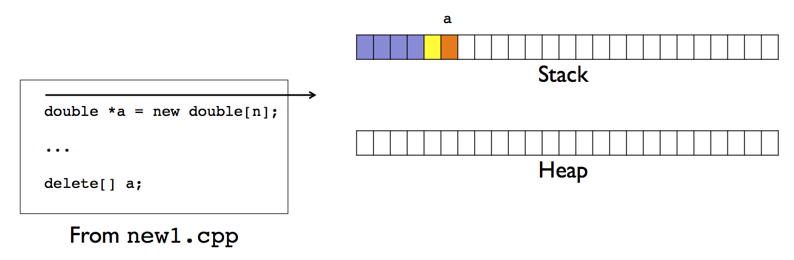
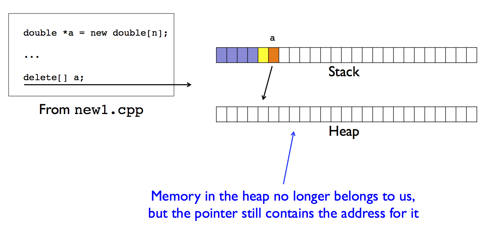
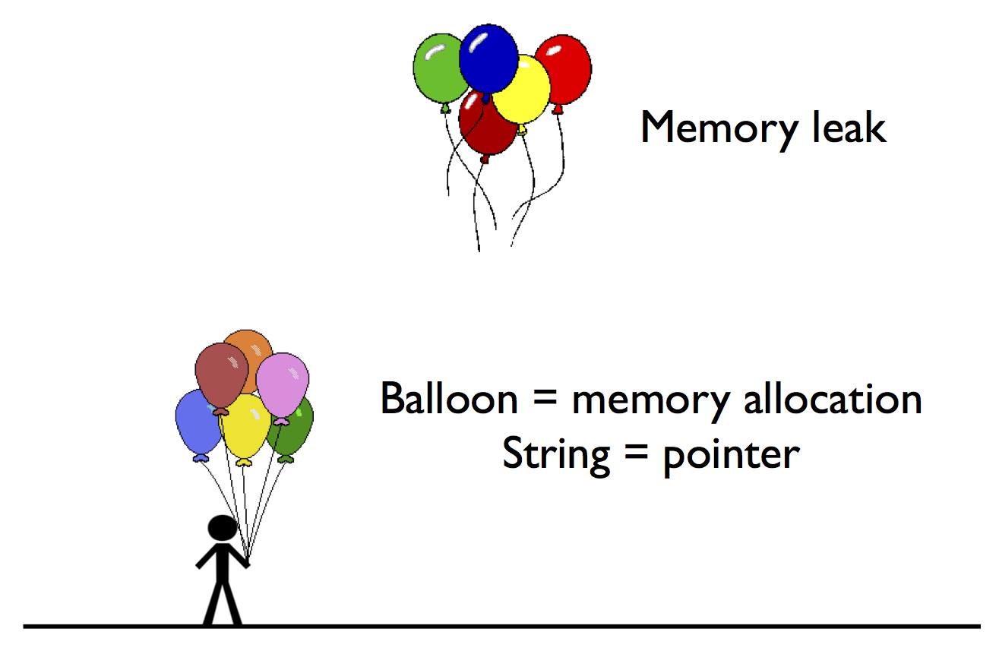

# CME 211: Lecture 25

Friday, November 20, 2015

Topic: C++ memory management

## Python memory management


## C/C++ memory model

* All data in your application is stored in the same physical memory

* The memory used by each application is logically divided into the *stack* and
the *heap*

## Stack

* Fixed memory allocation provided to your application

* It is the operating system that specifies the size of the stack

* Stack memory is automatically managed for you by the compiler / processor

* Limited to local variables of fixed size

### Stack example


### Function call


### Static arrays


### Static array example

`src/stack4.cpp`:

```c++
#include <iostream>

int main() {
  int a[2048][2048];
  a[0][0] = 42;
  std::cout << "a[0][0] = " << a[0][0] << std::endl;
  return 0;
}
```

Output:

```
$ g++ -Wall -Wextra -Wconversion src/stack4.cpp -o src/stack4
$ ./src/stack4
Segmentation fault (core dumped)
```


### Static size limit

Output:

```
$ ulimit -a
core file size          (blocks, -c) 0
data seg size           (kbytes, -d) unlimited
scheduling priority             (-e) 0
file size               (blocks, -f) unlimited
pending signals                 (-i) 30601
max locked memory       (kbytes, -l) 64
max memory size         (kbytes, -m) unlimited
open files                      (-n) 1024
pipe size            (512 bytes, -p) 8
POSIX message queues     (bytes, -q) 819200
real-time priority              (-r) 0
stack size              (kbytes, -s) 4096
cpu time               (seconds, -t) unlimited
max user processes              (-u) 4096
virtual memory          (kbytes, -v) unlimited
file locks                      (-x) unlimited
```

### Modifying the stack size limit

```
$ ulimit -s unlimited
-bash: ulimit: stack size: cannot modify limit: Operation not permitted
$ ulimit -s 16384
-bash: ulimit: stack size: cannot modify limit: Operation not permitted
$ ulimit -s 4096
$
```

* On `corn` we cannot make the stack size larger, but we can make it smaller!

### Stack size

`src/stack5.cpp`:

```c++
#include <vector>

#include "boost/multi_array.hpp"

int main() {
  std::vector<unsigned int> a;
  for(unsigned int i = 0; i < 8192*8192; i++)
    a.push_back(i);

  boost::multi_array<unsigned int, 2> b(boost::extents[8192][8192]);

  return 0;
}
```

### Stack size

Output:

```
$ ulimit -a
core file size          (blocks, -c) 0
data seg size           (kbytes, -d) unlimited
scheduling priority             (-e) 0
file size               (blocks, -f) unlimited
pending signals                 (-i) 30601
max locked memory       (kbytes, -l) 64
max memory size         (kbytes, -m) unlimited
open files                      (-n) 1024
pipe size            (512 bytes, -p) 8
POSIX message queues     (bytes, -q) 819200
real-time priority              (-r) 0
stack size              (kbytes, -s) 4096
cpu time               (seconds, -t) unlimited
max user processes              (-u) 4096
virtual memory          (kbytes, -v) unlimited
file locks                      (-x) unlimited
$ g++ -std=c++11 -Wall -Wextra -Wconversion src/stack5.cpp -o src/stack5
$ ./src/stack5
```

## Heap

* Can contain data of arbitrary size (subject to available computer resources
like total memory)

* Accessible by any function (global scope)

* Has the life of the program

* *Managed by programmer*

### Using heap memory

* You need to allocate heap memory

* The location of the allocated memory is stored in a pointer, a special
variable which stores a memory address

* When you are done using the memory you need to free the memory

### Pointers

Declaration of a pointer is denoted by a `*` in front of the variable name
  (after the type)

* `int a;`: variable `a` will contain an integer

* `int *b;`: variable `b` will contain a memory address where an integer is
  stored

* `int* b;`: equivalent to `int *b;`.  This is my prefered style.  I would read
  it as: "`b` is a variable containing a pointer to an int".  Hint: read C and
  C++ type declarations backwards.

### Pointers contain addresses


### Many roles of the `*`

* We've already seen that the asterisk is used to denote the declaration of a
pointer

* The asterisk is also used to access the data at the memory address stored in a
pointer

* This operation is typically call *dereferencing*

### Dereferencing a pointer

`src/pointer1.cpp`:

```c++
#include <iostream>

int main() {
  int a = 42;
  int* b; // b is a pointer to an int

  std::cout << " a = " << a << std::endl;
  std::cout << "&a = " << &a << std::endl;

  b = &a; // here & is the "address of" operator

  // show the value of the pointer
  std::cout << " b = " << b << std::endl;

  // dereference the pointer
  std::cout << "*b = " << *b << std::endl;

  return 0;
}
```

Output:

```
$ g++ -std=c++11 -Wall -Wextra -Wconversion src/pointer1.cpp -o src/pointer1
$ ./src/pointer1
 a = 42
&a = 0x7ffdf7b3efa4
 b = 0x7ffdf7b3efa4
*b = 42
```

### Store a value at a memory address

The asterisk in front of a pointer has a different meaning when it appears on
the left of the assignment operator (`=`)

```c++
int a = 42;
int *b;
b = &a;
// store the value 7 at the memory address in b
*b = 7;
```

### Storing a value

`src/pointer2.cpp`:

```c++
#include <iostream>

int main() {
  int a = 42;
  int *b;
  b = &a;

  std::cout << " a = " << a << std::endl;
  std::cout << "&a = " << &a << std::endl;
  std::cout << " b = " << b << std::endl;
  std::cout << "*b = " << *b << std::endl;

  // Store the value 7 at the
  // memory address stored in b
  *b = 7;

  std::cout << " a = " << a << std::endl;
  std::cout << "&a = " << &a << std::endl;
  std::cout << " b = " << b << std::endl;
  std::cout << "*b = " << *b << std::endl;

  return 0;
}
```

Output:

```
$ g++ -std=c++11 -Wall -Wextra -Wconversion src/pointer2.cpp -o src/pointer2
$ ./src/pointer2
 a = 42
&a = 0x7ffccf457cd4
 b = 0x7ffccf457cd4
*b = 42
 a = 7
&a = 0x7ffccf457cd4
 b = 0x7ffccf457cd4
*b = 7
```

### Increment

`src/increment.cpp`:

```c++
#include <iostream>

void increment(int *a) {
  // Value at the memory
  // address is incremented
  (*a)++;
}

int main() {
  int a = 2;
  std::cout << "a = " << a << std::endl;

  // increment() receives copy of memory address for a
  increment(&a);
  std::cout << "a = " << a << std::endl;

  return 0;
}
```

Output:

```
$ g++ -std=c++11 -Wall -Wextra -Wconversion src/increment.cpp -o src/increment
$ ./src/increment
a = 2
a = 3
```

### Increment


### Returning pointers

`src/func.cpp`:

```c++
#include <iostream>

int* func(void) {
  int b = 2;
  return &b;
}

int main() {
  int *a = func();

  std::cout << " a = " << a << std::endl;
  std::cout << "*a = " << *a << std::endl;

  return 0;
}
```

Output:

```
$ g++ -std=c++11 -Wall -Wextra -Wconversion src/func.cpp -o src/func
src/func.cpp: In function ‘int* func()’:
src/func.cpp:4:7: warning: address of local variable ‘b’ returned [-Wreturn-local-addr]
   int b = 2;
       ^
$ ./src/func
 a = 0x7ffc716c177c
*a = 32577
```

### Returning pointers


### Common mistake: pointer declaration

(There are many!)

`double *a, b;`

* `a` is a pointer to a double

* `b` is a double

`double *a, *b;`

* `a` is a pointer to a double

* `b` is a pointer to a double

`double* a, b;`

* `a` is a pointer to a double

* `b` is a **double**

### Many uses of `*`

`src/pointer3.cpp`:

```c++
#include <iostream>

int main() {
  int a = 4;
  int *b = &a;

  // * used for dereferencing, multiplication, and storage
  *b = *b**b;

  std::cout << "a = " << a << std::endl;

  return 0;
}
```

Output:

```
$ g++ -std=c++11 -Wall -Wextra -Wconversion src/pointer3.cpp -o src/pointer3
$ ./src/pointer3
a = 16
```

### Common mistake: uninitialized pointer

`src/pointer4.cpp`:

```c++
#include <iostream>

int main() {
  int *a;
  std::cout << "*a = " << *a << std::endl;
  return 0;
}
```

Output:

```
$ g++ -std=c++11 -Wall -Wextra -Wconversion src/pointer4.cpp -o src/pointer4
src/pointer4.cpp: In function ‘int main()’:
src/pointer4.cpp:5:28: warning: ‘a’ is used uninitialized in this function [-Wuninitialized]
   std::cout << "*a = " << *a << std::endl;
                            ^
$ ./src/pointer4
*a = -1991643855
```

### Suggestion

`src/pointer5.cpp`:

```c++
#include <iostream>

int main() {
  int *a = nullptr;
  std::cout << "*a = " << *a << std::endl;
  return 0;
}
```

Output:

```
$ g++ -std=c++11 -Wall -Wextra -Wconversion src/pointer5.cpp -o src/pointer5
$ ./src/pointer5
```

### `new`

* the `new` keyword *allocates* dynamic memory in the *heap*

* Works by setting aside a specified amount of *contiguous memory* and returning
the *starting address*

* No guarantees about the state of initialization (i.e. the memory will have
"random" data in it)

### Memory allocation

`src/new1.cpp`:

```c++
#include <iostream>
#include <string>

int main(int argc, char *argv[]) {
  if (argc < 2) return 1;
  unsigned int n = std::stoi(argv[1]);

  // Allocate storage for n double values and
  // store the starting address in a
  double *a = new double[n];
  std::cout << "a = " << a << std::endl;

  for (unsigned int i = 0; i < n; i++)
    a[i] = i+3;

  for (unsigned int i = 0; i < n; i++)
    std::cout << "a[" << i << "] = " << a[i] << std::endl;

  // Free the memory
  delete[] a;
  std::cout << "a = " << a << std::endl;

  return 0;
}
```

Output:

```
$ g++ -std=c++11 -Wall -Wextra -Wconversion src/new1.cpp -o src/new1
$ ./src/new1 2
a = 0x8f5040
a[0] = 3
a[1] = 4
a = 0x8f5040
$ ./src/new1 4
a = 0x2405010
a[0] = 3
a[1] = 4
a[2] = 5
a[3] = 6
a = 0x2405010
```

### Memory allocation sequence

Step 1:



Step 2:


Step 3:



### Out of bounds access

`src/new2.cpp`:

```c++
#include <iostream>
#include <string>

int main(int argc, char *argv[]) {
  if (argc < 2) return 1;
  unsigned int n = std::stoi(argv[1]);

  double *a = new double[n];
  std::cout << "a = " << a << std::endl;

  delete[] a;
  std::cout << "a = " << a << std::endl;

  for (unsigned int i = 0; i < n; i++)
    a[i] = i+3;

  for (unsigned int i = 0; i < n; i++)
    std::cout << "a[" << i << "] = " << a[i] << std::endl;

  return 0;
}
```

Output:

```
$ g++ -std=c++11 -Wall -Wextra -Wconversion src/new2.cpp -o src/new2
$ ./src/new2 2
a = 0xe98040
a = 0xe98040
a[0] = 3
a[1] = 4
$ ./src/new2 1048576
a = 0x7f8bf1c0b010
a = 0x7f8bf1c0b010
Segmentation fault (core dumped)
```

### Use valgrind

* compile with `-g` flag

* run with `valgrind`

Output:

```
$ g++ -g -std=c++11 -Wall -Wextra -Wconversion src/new2.cpp -o src/new2
$ valgrind ./src/new2 4
==29156== Memcheck, a memory error detector
==29156== Copyright (C) 2002-2013, and GNU GPL'd, by Julian Seward et al.
==29156== Using Valgrind-3.10.1 and LibVEX; rerun with -h for copyright info
==29156== Command: ./src/new2 4
==29156==
a = 0x5a200a0
a = 0x5a200a0
==29156== Invalid write of size 8
==29156==    at 0x400FF4: main (new2.cpp:15)
==29156==  Address 0x5a200a0 is 0 bytes inside a block of size 32 free'd
==29156==    at 0x4C2B633: operator delete[](void*) (in /usr/lib64/valgrind/vgpreload_memcheck-amd64-linux.so)
==29156==    by 0x400F6A: main (new2.cpp:11)
==29156==
==29156== Invalid read of size 8
==29156==    at 0x40101E: main (new2.cpp:18)
==29156==  Address 0x5a200a0 is 0 bytes inside a block of size 32 free'd
==29156==    at 0x4C2B633: operator delete[](void*) (in /usr/lib64/valgrind/vgpreload_memcheck-amd64-linux.so)
==29156==    by 0x400F6A: main (new2.cpp:11)
==29156==
a[0] = 3
a[1] = 4
a[2] = 5
a[3] = 6
==29156==
==29156== HEAP SUMMARY:
==29156==     in use at exit: 0 bytes in 0 blocks
==29156==   total heap usage: 2 allocs, 2 frees, 58 bytes allocated
==29156==
==29156== All heap blocks were freed -- no leaks are possible
==29156==
==29156== For counts of detected and suppressed errors, rerun with: -v
==29156== ERROR SUMMARY: 8 errors from 2 contexts (suppressed: 0 from 0)
```

### Suggestion

`src/new3.cpp`:

```c++
#include <iostream>
#include <string>

int main(int argc, char *argv[]) {
  if (argc < 2) return 1;
  unsigned int n = std::stoi(argv[1]);

  double *a = new double[n];

  delete[] a;
  a = nullptr;

  for (unsigned int i = 0; i < n; i++)
    a[i] = i+3;

  for (unsigned int i = 0; i < n; i++)
    std::cout << "a[" << i << "] = " << a[i] << std::endl;

  return 0;
}
```

```
$ g++ -std=c++11 -Wall -Wextra -Wconversion src/new3.cpp -o src/new3
$ ./src/new3 2
Segmentation fault (core dumped)
```

### Memory allocation in a function

`src/new4.cpp`:

```c++
#include <iostream>
#include <string>

double * AllocateArray(unsigned int n) {
  //Memory allocated, accessed, and pointer to it returned
  double *a = new double[n];
  for (unsigned int i = 0; i < n; i++) a[i] = 0.;
  return a;
}

int main(int argc, char *argv[]) {
  if (argc < 2) return 1;
  unsigned int n = std::stoi(argv[1]);

  // Returned memory address stored in stack variable
  double *a = AllocateArray(n);

  // Memory is now used by main()
  for (unsigned int i = 0; i < n; i++)
    a[i] = i+3;
  for (unsigned int i = 0; i < n; i++)
    std::cout << "a[" << i << "] = " << a[i] << std::endl;

  delete[] a; // Memory is freed
  a = NULL;

  return 0;
}
```

Output:

```
$ g++ -std=c++11 -g -Wall -Wextra -Wconversion src/new4.cpp -o src/new4
$ valgrind ./src/new4 4
==29162== Memcheck, a memory error detector
==29162== Copyright (C) 2002-2013, and GNU GPL'd, by Julian Seward et al.
==29162== Using Valgrind-3.10.1 and LibVEX; rerun with -h for copyright info
==29162== Command: ./src/new4 4
==29162==
a[0] = 3
a[1] = 4
a[2] = 5
a[3] = 6
==29162==
==29162== HEAP SUMMARY:
==29162==     in use at exit: 0 bytes in 0 blocks
==29162==   total heap usage: 2 allocs, 2 frees, 58 bytes allocated
==29162==
==29162== All heap blocks were freed -- no leaks are possible
==29162==
==29162== For counts of detected and suppressed errors, rerun with: -v
==29162== ERROR SUMMARY: 0 errors from 0 contexts (suppressed: 0 from 0)
```

### Memory leaks

`src/new5.cpp`:

```c++
#include <iostream>
#include <string>

void ProcessData(double *a, unsigned int n) {
  // temporary allocation for processing a
  // Memory is allocated but never freed
  double *tmp = new double[n];
  for (unsigned int i = 0; i < n; i++) tmp[i] = 0.;

  // Process a
  a[0] = tmp[0];

  return;
}

int main(int argc, char *argv[]) {
  if (argc < 2) return 1;
  unsigned int n = std::stoi(argv[1]);

  double *a = new double[n];

  // Process a
  ProcessData(a, n);

  delete[] a;
  a = nullptr;

  return 0;
}
```

Output:

```
$ g++ -std=c++11 -g -Wall -Wextra -Wconversion src/new5.cpp -o src/new5
$ valgrind ./src/new5 4
==29168== Memcheck, a memory error detector
==29168== Copyright (C) 2002-2013, and GNU GPL'd, by Julian Seward et al.
==29168== Using Valgrind-3.10.1 and LibVEX; rerun with -h for copyright info
==29168== Command: ./src/new5 4
==29168==
==29168==
==29168== HEAP SUMMARY:
==29168==     in use at exit: 32 bytes in 1 blocks
==29168==   total heap usage: 3 allocs, 2 frees, 90 bytes allocated
==29168==
==29168== LEAK SUMMARY:
==29168==    definitely lost: 32 bytes in 1 blocks
==29168==    indirectly lost: 0 bytes in 0 blocks
==29168==      possibly lost: 0 bytes in 0 blocks
==29168==    still reachable: 0 bytes in 0 blocks
==29168==         suppressed: 0 bytes in 0 blocks
==29168== Rerun with --leak-check=full to see details of leaked memory
==29168==
==29168== For counts of detected and suppressed errors, rerun with: -v
==29168== ERROR SUMMARY: 0 errors from 0 contexts (suppressed: 0 from 0)
```

### C++ memory management



## Containers

* Object is a stack variable

* One (or more) data attributes point to heap memory

### Vector implementation

`src/MyVector1.hpp`:

```c++
#pragma once

class MyVector
{
 private:
  int *data;
  unsigned int size;
  unsigned int capacity;
 public:
  MyVector();
  void push_back(int val);
  void print(void);
};
```

`src/MyVector1.cpp`:

```c++
#include <iostream>

#include "MyVector1.hpp"

MyVector::MyVector() {
  size = 0;
  capacity = 10;
  data = new int[capacity];
}

void MyVector::push_back(int val) {
  if (size < capacity) {
    data[size] = val;
    size++;
  }
  else {
    // A real implementation would resize the capacity
    std::cerr << "Vector is full" << std::endl;
    exit(1);
  }
}

void MyVector::print() {
  using std::cout;
  using std::endl;
  cout << "[";
  bool comma = false;
  for (unsigned int i = 0; i < size; ++i) {
    if (comma) {
      cout << ", ";
    }
    else {
      comma = true;
    }
    cout << data[i];
  }
  cout << ']';
}
```

`src/main1.cpp`:

```c++
#include <iostream>
#include "MyVector1.hpp"

void func(void) {
  // Create an instance of the MyVector class
  MyVector v;
  v.push_back(7);
  v.push_back(42);
  v.print();
  std::cout << std::endl;
}

int main() {
  func();
  return 0;
}
```

Output:

```
$ g++ -g -std=c++11 -Wall -Wextra -Wconversion src/main1.cpp src/MyVector1.cpp -o src/main1
$ ./src/main1
[7, 42]
```

### Memory leak

Output:

```
$ valgrind ./src/main1
==29177== Memcheck, a memory error detector
==29177== Copyright (C) 2002-2013, and GNU GPL'd, by Julian Seward et al.
==29177== Using Valgrind-3.10.1 and LibVEX; rerun with -h for copyright info
==29177== Command: ./src/main1
==29177==
[7, 42]
==29177==
==29177== HEAP SUMMARY:
==29177==     in use at exit: 40 bytes in 1 blocks
==29177==   total heap usage: 1 allocs, 0 frees, 40 bytes allocated
==29177==
==29177== LEAK SUMMARY:
==29177==    definitely lost: 40 bytes in 1 blocks
==29177==    indirectly lost: 0 bytes in 0 blocks
==29177==      possibly lost: 0 bytes in 0 blocks
==29177==    still reachable: 0 bytes in 0 blocks
==29177==         suppressed: 0 bytes in 0 blocks
==29177== Rerun with --leak-check=full to see details of leaked memory
==29177==
==29177== For counts of detected and suppressed errors, rerun with: -v
==29177== ERROR SUMMARY: 0 errors from 0 contexts (suppressed: 0 from 0)
```

## Destructor

`src/MyVector2.hpp`:

```c++
#pragma once

class MyVector
{
 private:
  int *data;
  unsigned int size;
  unsigned int capacity;
 public:
  MyVector();
  void push_back(int val);
  void print(void);
  ~MyVector();
};
```

From `src/MyVector2.cpp`:

```c++
MyVector::~MyVector() {
  delete[] data;
  data = nullptr;
}
```

Output:

```
$ g++ -g -std=c++11 -Wall -Wextra -Wconversion src/main2.cpp src/MyVector2.cpp -o src/main2
$ ./src/main2
[7, 42]
$ valgrind ./src/main2
==29192== Memcheck, a memory error detector
==29192== Copyright (C) 2002-2013, and GNU GPL'd, by Julian Seward et al.
==29192== Using Valgrind-3.10.1 and LibVEX; rerun with -h for copyright info
==29192== Command: ./src/main2
==29192==
[7, 42]
==29192==
==29192== HEAP SUMMARY:
==29192==     in use at exit: 0 bytes in 0 blocks
==29192==   total heap usage: 1 allocs, 1 frees, 40 bytes allocated
==29192==
==29192== All heap blocks were freed -- no leaks are possible
==29192==
==29192== For counts of detected and suppressed errors, rerun with: -v
==29192== ERROR SUMMARY: 0 errors from 0 contexts (suppressed: 0 from 0)
```

### C++ memory management


## Reading

**C++ Primer, Fifth Edition** by Lippman et al:

* Section 2.3.2: Pointers

* Section 12.2: Dynamic Arrays

* Section 7.1.5: Destruction
