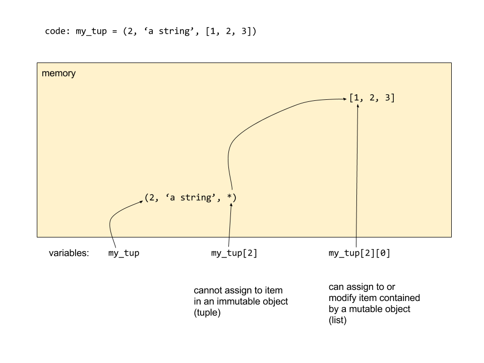

# CME 211 Lecture 4: Python containers

Monday, September 28, 2015

## Announcements

- Screencasts posted to Piazza


## Container review

- *Containers* are objects that contain one or more other objects

- *Containers* are sometimes called "collections" or "data structures"

- In lecture 3, we spent sometime looking at the Python `list` container

- Today we will see Dictionaries and Tuples

## List review

- Python lists store objects in a specified sequence

```py
>>> cme211_tas = ["josh", "evan", "oliver", "swaroop"]
```

- Accessing a single item is done via square brackets

```py
>>> cme211_tas[2]
'oliver'
```

- You can get a sub-list with a slice:

```py
>>> cme211_tas[1:3]
['evan', 'oliver']
```

- Note that slicing creates a new list:

```py
>>> two_tas = cme211_tas[1:3]
>>> two_tas
['evan', 'oliver']
>>> two_tas[0] = 'bob'
>>> two_tas
['bob', 'oliver']
>>> cme211_tas
['josh', 'evan', 'oliver', 'swaroop']
>>>
```

## List methods

See `>>> help(list)` to get a list of the list methods.  This should open a
"pager" in your python iterpreter.  The "pager" allows you to view the help text
one page at a time.  On my computer the pager is the `less` program.  Hitting
the key `g` goes back to the top of the help text.  Hitting the space bar moves
one page forward in the help documentation.  For reference here are the built-in
methods for Python `list` objects:

```
append(...)
    L.append(object) -- append object to end

count(...)
    L.count(value) -> integer -- return number of occurrences of value

extend(...)
    L.extend(iterable) -- extend list by appending elements from the iterable

index(...)
    L.index(value, [start, [stop]]) -> integer -- return first index of value.
    Raises ValueError if the value is not present.

insert(...)
    L.insert(index, object) -- insert object before index

pop(...)
    L.pop([index]) -> item -- remove and return item at index (default last).
    Raises IndexError if list is empty or index is out of range.

remove(...)
    L.remove(value) -- remove first occurrence of value.
    Raises ValueError if the value is not present.

reverse(...)
    L.reverse() -- reverse *IN PLACE*

sort(...)
    L.sort(cmp=None, key=None, reverse=False) -- stable sort *IN PLACE*;
    cmp(x, y) -> -1, 0, 1
```

The methods in the help documentation that start and end with underscores (for
example, `__add__`) refer to methods that are called through python operators.
The `__add__` method is called when the `+` operator is called on lists:

```py
>>> cme211_tas + ['loek']
['josh', 'evan', 'oliver', 'swaroop', 'loek']
>>> cme211_tas.__add__(['loek'])
['josh', 'evan', 'oliver', 'swaroop', 'loek']
>>> 
```

## Dictionaries

- Dictionaries are an *associateive container*.  They contain *keys* with
  associated *values*

- Dictionaries in Python are denoted by curly braces

    - Create an empty dictionary: `empty_dict = {}`

    - Create a dictionary with some data: `ages = {"brad": 51, "angelina": 40}`

- Values can be any python object: numbers, strings, lists, other dictionaries

- Keys can be any immutable object: numbers, strings, tuples (containing
  immutabled data)

- No sense of order in a python dictionary.  When used in a loop, the key-value
  pairs may come out in any order.

- Access values associated with a key with square brackets:
  `value = dictionary[key]`

### Create a dictionary

```py
>>> ages = {} # or ages = dict()
>>> ages['brad'] = 51
>>> ages['angelina'] = 40
>>> ages['leo'] = 40
>>> ages['bruce'] = 60
>>> ages
{'bruce': 60, 'angelina': 40, 'leo': 40, 'brad': 51}
```

### Access items

```py
>>> ages['leo']
40
```

When the key does not exist:

```py
>>> ages['helen']
Traceback (most recent call last):
  File "<stdin>", line 1, in <module>
KeyError: 'helen'
>>>
```

Or you can use the `get()` method:

```py
>>> temp = ages.get('brad')
>>> print(temp)
51
>>> temp = ages.get('helen')
>>> print(temp)
None
```

### Iteration

Iterate through the keys with:

```py
>>> for key in ages:
...     print("{} = {}".format(key,ages[key]))
... 
bruce = 60
angelina = 40
leo = 40
brad = 51
>>> 
```

Iterate through key-values pairs with:

```py
>>> for k, v in ages.items():
...     print('{} = {}'.format(k,v))
... 
bruce = 60
angelina = 40
leo = 40
brad = 51
```

The above syntax is more efficient in Python 3.  To achieve equivalent
performance in Python 2, it is best to ask for an *iterator* over the key-value
pairs:

```py
>>> for k, v in ages.iteritems():
...     print('{} = {}'.format(k,v))
... 
bruce = 60
angelina = 40
leo = 40
brad = 51
```

We will discuss *iterators* in more detail later.  In Python 2 the dictionary
`items()` method returns a newly-created list of *tuples*:

```py
>>> ages.items()
[('bruce', 60), ('angelina', 40), ('leo', 40), ('brad', 51)]
```

This requires memory allocation and data copying.  The `iteritems()` method (or
`items()` method in Python 3) returns an *iterator*:

```py
>>> ages.iteritems()
<dictionary-itemiterator object at 0x7f509e06d260>
```

This is a Python object that provides access to the data in a container in a
sequential fashion **without** requiring the creation of a new data structure
and copying of data.

### Dictionary methods

See `help(dict)` to get a summary of all dictionary methods:

```
clear(...)
    D.clear() -> None.  Remove all items from D.

copy(...)
    D.copy() -> a shallow copy of D

fromkeys(...)
    dict.fromkeys(S[,v]) -> New dict with keys from S and values equal to v.
    v defaults to None.

get(...)
    D.get(k[,d]) -> D[k] if k in D, else d.  d defaults to None.

has_key(...)
    D.has_key(k) -> True if D has a key k, else False

items(...)
    D.items() -> list of D's (key, value) pairs, as 2-tuples

iteritems(...)
    D.iteritems() -> an iterator over the (key, value) items of D

iterkeys(...)
    D.iterkeys() -> an iterator over the keys of D

itervalues(...)
    D.itervalues() -> an iterator over the values of D

keys(...)
    D.keys() -> list of D's keys

pop(...)
    D.pop(k[,d]) -> v, remove specified key and return the corresponding value.
    If key is not found, d is returned if given, otherwise KeyError is raised

popitem(...)
    D.popitem() -> (k, v), remove and return some (key, value) pair as a
    2-tuple; but raise KeyError if D is empty.

setdefault(...)
    D.setdefault(k[,d]) -> D.get(k,d), also set D[k]=d if k not in D

update(...)
    D.update([E, ]**F) -> None.  Update D from dict/iterable E and F.
    If E present and has a .keys() method, does:     for k in E: D[k] = E[k]
    If E present and lacks .keys() method, does:     for (k, v) in E: D[k] = v
    In either case, this is followed by: for k in F: D[k] = F[k]

values(...)
    D.values() -> list of D's values

viewitems(...)
    D.viewitems() -> a set-like object providing a view on D's items

viewkeys(...)
    D.viewkeys() -> a set-like object providing a view on D's keys

viewvalues(...)
    D.viewvalues() -> an object providing a view on D's values
```

## Tuples

- Tuples are essentially immutable lists

- Tuples are denoted with parentheses: `tup = (1,2,3)`

- Tuples store data in order

- Items in tuples are accessed via indexing and slicing

- Tuple items may not be changed.  (However, if a tuple contains a modifiable
object such as a list, the contained object may be modified)

### Tuple examples

Basic usage:

```py
>>> days = ('Su', 'M', 'Tu', 'W', 'Th', 'F', 'Sa')
>>> days[5]
'F'
>>> days[3:6]
('W', 'Th', 'F')
>>> days[1] = 'C'
Traceback (most recent call last):
  File "<stdin>", line 1, in <module>
TypeError: 'tuple' object does not support item assignment
>>>
```

Modifiable objects contained in a tuple are still modifiable:

```py
>>> my_tup = (2, 'a string', [1,3,8])
>>> my_tup[2]
[1, 3, 8]
>>> my_tup[2] = 'something else'
Traceback (most recent call last):
  File "<stdin>", line 1, in <module>
TypeError: 'tuple' object does not support item assignment
>>> my_tup[2][0] = 'new data'
>>> my_tup
(2, 'a string', ['new data', 3, 8])
>>> 
```

### Tuple modifiability diagram




