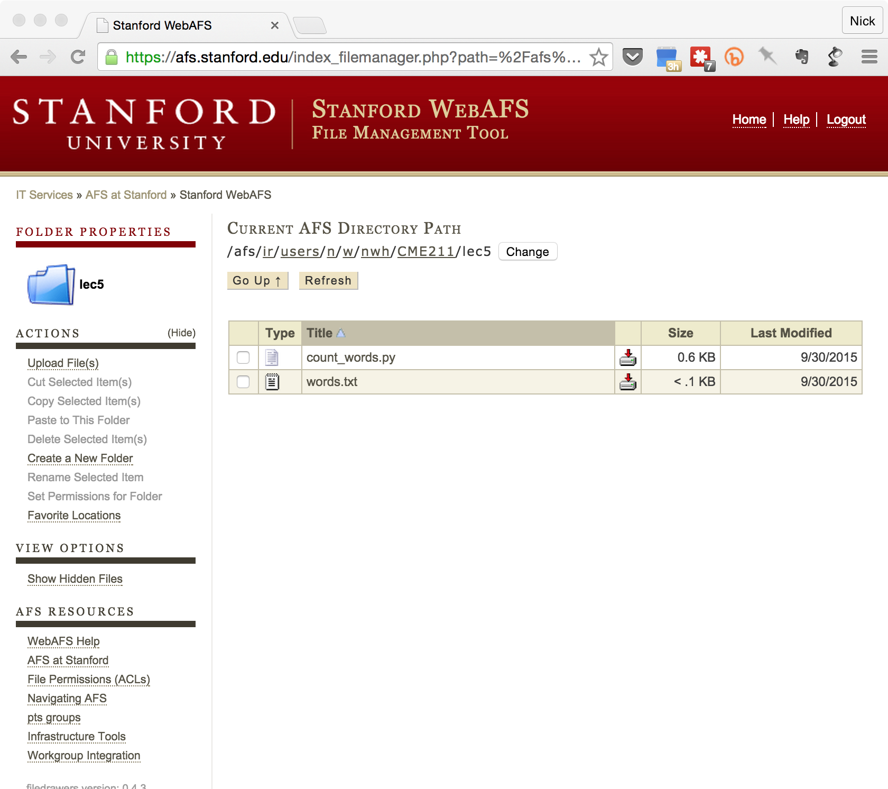

# CME 211 Lecture 5: Complexity Analysis

Wednesday, September 30, 2015

# Warning: these notes are not complete

## Announcements

* We will be using [GitHub][GitHub] for version control and managing assignment
  submissions in this course. If you haven't already done so, please create a
  personal Github account at <https://github.com/>. Feel free to link the
  account to whatever email that you prefer (i.e. it does not need to be your
  `stanford.edu` email). Afterward, please fill out the [Google form][gh-form].

* Note: *SUNetID* refers to the first part of your stanford email address.  My
  SUNetID is `nwh`.  Please do not put your student ID number in the above form.

* Goal: we need to associate your GitHub username with your stanford username
  (SUNetID)

* In class I've shown IPython (Jupyter) notebooks and recommended the install of
  Anaconda Python.  We recommend that you use the web and each other for tech
  support related to these packages.  Computers and software are complicated
  things.  In this class, we must standardize and can only support your code
  running on the Farmshare systems.  Feel free to ask us for help, but we may
  decline based on time or requests from other students.  We will help you with
  farmshare issues.

[GitHub]: https://github.com/
[gh-form]: https://docs.google.com/forms/d/1JyNmmn2Ur6WTwUrI4jvCSpDNv6jph48mFUXu6lF-G2Q/viewform

## Farmshare review

Your first assignment must run on and be submitted throught the farmshare
servers.  Let's walk through the process of creating a Python script and data
file locally then move it over to farmshare.  We will use the same conventions
as homework 1.

Please note that these instructions will work best on Mac OS X.  If you are on
Windows, you will need to follow the spirit of the instructions.

### Create a local directory structure for the class

1. Open your terminal program (`Terminal.app` on OSX).

2. Follow the sequence of commands:

```
nwh-mbpro:~ nwh$ cd
nwh-mbpro:~ nwh$ pwd
/Users/nwh
nwh-mbpro:~ nwh$ mkdir CME211
nwh-mbpro:~ nwh$ cd CME211/
nwh-mbpro:CME211 nwh$ mkdir lec5
nwh-mbpro:CME211 nwh$ cd lec5/
nwh-mbpro:lec5 nwh$ pwd
/Users/nwh/CME211/lec5
```

Notes:

* `cd` by itself moves to your home directory
* `~` is an alias for your home directory
* Homework 1 requires that your files be placed in `~/CME211/hw1` on farmshare

### Exercise

Let's write a short python script to count unique words in a data file.  The
data file will have one word per line.

### Create a data file

Open your favorite text editor and create the file `~/CME211/lec5/words.txt`.
Enter the following contents:

```
this
is
a
short
file
this
is
also
a
rainy
day
```
### Create a python script to count words

```py
# file name uses relative path
data_file = "words.txt"

f = open(data_file,"r")

# dictionary to store unique words as keys and counts as values
word_dict = dict()

# count the words
for line in f:
    # remove the new line character
    word = line.strip()
    if word in word_dict:
        # word is in dictionary, increment count
        word_dict[word] += 1
    else:
        # word is not yet in dictionary, set count to 1
        word_dict[word] = 1

# print the word counts
for word, count in word_dict.items():
    print("'{}' appeared {} time(s)".format(word,count))
```

### Test the script locally:

```
nwh-mbpro:lec5 nwh$ python count_words.py 
'a' appeared 2 time(s)
'rainy' appeared 1 time(s)
'short' appeared 1 time(s)
'this' appeared 2 time(s)
'is' appeared 2 time(s)
'also' appeared 1 time(s)
'file' appeared 1 time(s)
'day' appeared 1 time(s)
```

### Move onto Farmshare with WebAFS

Log into <https://afs.stanford.edu/>.  You will see your farmshare files.  With
this interface you can create directories and upload files.


Create a new folder:


Upload files:


Final result:



### Test the program on Farmshare

```
nwh-mbpro:lec5 nwh$ ssh nwh@corn.stanford.edu
nwh@corn26:~$ cd CME211/lec5/
nwh@corn26:~/CME211/lec5$ ls
count_words.py	words.txt
nwh@corn26:~/CME211/lec5$ python count_words.py 
'a' appeared 2 time(s)
'rainy' appeared 1 time(s)
'short' appeared 1 time(s)
'this' appeared 2 time(s)
'is' appeared 2 time(s)
'also' appeared 1 time(s)
'file' appeared 1 time(s)
'day' appeared 1 time(s)
# edit the data file
nwh@corn26:~/CME211/lec5$ emacs words.txt 
nwh@corn26:~/CME211/lec5$ python count_words.py 
'a' appeared 2 time(s)
'rainy' appeared 4 time(s)
'short' appeared 1 time(s)
'this' appeared 2 time(s)
'is' appeared 2 time(s)
'also' appeared 1 time(s)
'file' appeared 1 time(s)
'day' appeared 1 time(s)
nwh@corn26:~/CME211/lec5$
```

### Other method to copy files: `scp`

```
nwh-mbpro:lec5 nwh$ scp test.txt nwh@corn.stanford.edu:~/CME211/lec5/
Warning: Permanently added the RSA host key for IP address '171.67.215.107' to the listAuthenticated with partial success.
Duo two-factor login for nwh

Enter a passcode or select one of the following options:

 1. Duo Push to XXX-XXX-2441
 2. Phone call to XXX-XXX-2441
 3. SMS passcodes to XXX-XXX-2441

Passcode or option (1-3): 1
test.txt                                              100%   50     0.1KB/s   00:00    
nwh-mbpro:lec5 nwh$
```

See `$ man scp`

### Other method to copy files: `sftp`

```
nwh-mbpro:lec5 nwh$ sftp nwh@corn.stanford.edu
nwh@corn.stanford.edu's password: 
Authenticated with partial success.
Duo two-factor login for nwh

Enter a passcode or select one of the following options:

 1. Duo Push to XXX-XXX-2441
 2. Phone call to XXX-XXX-2441
 3. SMS passcodes to XXX-XXX-2441

Passcode or option (1-3): 1
Connected to corn.stanford.edu.
sftp> help
Available commands:
bye                                Quit sftp
cd path                            Change remote directory to 'path'
chgrp grp path                     Change group of file 'path' to 'grp'
chmod mode path                    Change permissions of file 'path' to 'mode'
chown own path                     Change owner of file 'path' to 'own'
df [-hi] [path]                    Display statistics for current directory or
                                   filesystem containing 'path'
exit                               Quit sftp
get [-Ppr] remote [local]          Download file
help                               Display this help text
lcd path                           Change local directory to 'path'
lls [ls-options [path]]            Display local directory listing
lmkdir path                        Create local directory
ln [-s] oldpath newpath            Link remote file (-s for symlink)
lpwd                               Print local working directory
ls [-1afhlnrSt] [path]             Display remote directory listing
lumask umask                       Set local umask to 'umask'
mkdir path                         Create remote directory
progress                           Toggle display of progress meter
put [-Ppr] local [remote]          Upload file
pwd                                Display remote working directory
quit                               Quit sftp
rename oldpath newpath             Rename remote file
rm path                            Delete remote file
rmdir path                         Remove remote directory
symlink oldpath newpath            Symlink remote file
version                            Show SFTP version
!command                           Execute 'command' in local shell
!                                  Escape to local shell
?                                  Synonym for help
sftp> 
```

http://linuxcommand.org/lc3_learning_the_shell.php

## Analysis of algorithms

* Time complexity: How does the

number of operations in an algorithm scale
with the size of the input?


* Space complexity: How do the storage
requirements of the algorithm scale?


3


## Empirical approach

import random!
import sys!
import time!
!
if len(sys.argv) < 2:!
print 'Usage:'!
print ' %s nvalues' % sys.argv[0]!
!
n = int(sys.argv[1])!
!
# Setup a list of random values and record the time required to sort it!
v = random.sample(xrange(n), n)!
t0 = time.time()!
v.sort()!
t1 = time.time()!
!
print "Sorting %d values took %.3f seconds." % (n, t1-t0)!

listsort.py!

4


## Empirical approach

plegresl@corn16:~/CME211/Lecture05$ python listsort.py
Sorting 1000000 values took 0.794 seconds.!
plegresl@corn16:~/CME211/Lecture05$ python listsort.py
Sorting 2000000 values took 1.854 seconds.!
plegresl@corn16:~/CME211/Lecture05$ python listsort.py
Sorting 4000000 values took 4.334 seconds.!
plegresl@corn16:~/CME211/Lecture05$ python listsort.py
Sorting 8000000 values took 9.695 seconds.!
plegresl@corn16:~/CME211/Lecture05$ python listsort.py
Sorting 16000000 values took 22.484 seconds.!
plegresl@corn16:~/CME211/Lecture05$ !

5


1000000!
2000000!
4000000!
8000000!
16000000!

## Problems with empirical

* Results are computer dependent

* You need to have the code before you can
do the analysis


6


## Time complexity

* Estimate of the number of operations as a

function of the input size (usually denoted as n)


* Typically characterized in terms of Big O

notation, e.g. an algorithm is O(n log n) or O(n2)

O(1)

O(log n)

O(n)

O(n log n)

O(n2)


Constant time

Logarithmic time

Linear time

Linearithmitic time

Quadratic time

7


## Visualization


8


## Big O notation

* Big O notation represents growth rate of a

function in the limit of argument going to infinity


* Excludes coefficients and lower order terms

2n2 + 64n

e

O(n2)


* Often some simplifying assumptions will need to
be made about the nature of the input data


9


## Linear algebra examples

* Adding two vectors? O(n)

* Multiplying two matrices? Assuming the
matrices are both n x n, it's O(n3)


[][] []
=


n x n


n x n


n x n


Computing one value in the output matrix requires O(n)
operations, and there are n2 values in the output matrix.

10


## Linear search

Find the number x in your data:


4


17


100


73


120


42


999


-17


Is it O(1), or O(n), or something else?


11


## Linear search: best and worst case


4


17


100


73


120


Best case: O(1)


42


999


-17


Worst case: O(n)


12


## Linear search: average case


4


17


100


73


120


Average case: O(n/2)

13


42


e

999


O(n)


-17


## Binary search algorithm

Find 17:

-17


4


17


42


73


100


120


999


-17


4


17


42


73


100


120


999


-17


4


17


42


73


100


120


999


14


## Binary search

* Requires that the data first be sorted, but
then:


* Best case: O(1)

* Average case: O(log n)

* Worst case: O(log n)

15


## Sorting algorithms

* Quicksort

* Merge sort

* Heapsort

* Timsort

* Bubble sort

* Radix sorts

* Etc.

16


## Bubble sort

http://www.youtube.com/watch?v=lyZQPjUT5B4


For more examples:

http://www.youtube.com/user/AlgoRythmics


17


## Sorting algorithms

Name


Best


Average


Worst


Memory


Stable


Quicksort


n log n


n log n


n2


Average log n,
worst n


Usually not


Merge sort


n log n


n log n


n log n


Worst n


Yes


Heapsort


n log n


n log n


n log n


1


No


Bubble sort


n


n2


n2


1


Yes


http://en.wikipedia.org/wiki/Sorting_algorithms#Comparison_of_algorithms

18


## Finding the maximum

What's the order of the algorithm to find
the maximum value in an unordered list?


17


1325


-3


346


73


19


999


120


0


## Maximum via sorting

* Sort the list ascending / descending and take
the last / first value


* Cost of the algorithm will be the cost of the

sorting plus one more operation to take the
last / first value


* Sorting algorithms are typically O(n log n) or
O(n2)


* Overall order of algorithm will clearly be the
order of the sorting algorithm

20


## Maximum via linear search

17


1325


-3


346


73


999


120


0


Is this the maximum value I've seen so far?

17


1325


-3


346


73


999


120


0


Is this the maximum value I've seen so far?

17


1325


-3


346


73


999


120


0


Is this the maximum value I've seen so far?

21


## Two largest values

* What's the complexity to find the two largest
values in an unordered list of n values?


22


## Two largest values

17


73


417

 346


73

 1325

 120


0


17


73


Sort


> ?

17


73


417

 346


73

 1325

 120


0


73


17


73


417


Sort

417


73


...

1325

 417

23


## Two largest values

* For each of n input elements you will do a

comparison, potentially a replacement, and a sort


* Time complexity is O(n)


* Does that mean that finding the two largest
values will take the same amount of time as
finding the single largest value?


24


## m largest values

* What if I want to find the m largest values
in an unordered list of n elements?


25


## More complicated algorithms


* May not be appropriate to characterize an
algorithm in terms of one parameter n


* Time complexity for finding the m largest

values in an unordered list of n elements
could be characterized as O(n m log m) for
a sorting algorithm that is O(m log m)


* For what m is it better just to sort the list?

26


## Finding substrings

TGTAGAATCACTTGAAAGGCGCGCAGTCTGGGGCGCTAGTCGTGGT

CTTGAAAGG


* String has length m, and substring has length n

* Algorithms could vary

* O(mn) for a naive implementation

* O(m) for typical algorithms

* O(n) for a search that uses the BurrowsWheeler transform


27


## List operations

>>> a = []!
>>> a.append(42)!
>>> a!
[42]!
>>> a.insert(0, 7)!
>>> a!
[7, 42]!
>>> a.insert(1, 19)!
>>> a!
[7, 19, 42]!
>>> !
28


## Python lists use contiguous storage

42!

?!

?!

?!

7!

42!

?!

?!

7!

19!

42!

?!

29


## List access

* What is the time complexity to access the
ith element of a list with n elements?


30


## List access


Start


Location of ith element


Computing the location of the ith
element is independent of n, so O(1)


31


## Which is better? And why?

names_list = []!
names_set = set([])!
f = open('dist.female.first')!
for line in f:!
name = line.split()[0]!
names_list.append(name)!
names_set.add(name)!
f.close()!
loadnames.py!
plegresl@corn16:~/CME211/Lecture05$ python -i loadnames.py !
>>> 'JANE' in names_list!
True!
>>> 'LELAND' in names_list!
False!
>>> 'JANE' in names_set !
True!
>>> 'LELAND' in names_set!
False!
>>> !
32

!

## Documentation


https://wiki.python.org/moin/TimeComplexity

33


## List operations


34


## Set operations


35


## Dictionary operations


36


## Space complexity

* What additional storage will I need during
execution of the algorithm?


* Doesn't include the input or output data

* Really just refers to temporary data structures
which have the life of the algorithm


* Process for determining the space complexity
is analogous to determining time complexity


37


## Complexity analysis


* Good framework for comparing algorithms

* Understanding individual algorithms will help you

understand performance of an application made up of
multiple algorithms


* Also important for understanding data structures

* Caveats:

*
*
*
*

There is no standard definition of what constitutes an operation

It's an asymptotic limit for large n

Says nothing about the constants

May make assumptions about dataset (random distribution, etc.)

38


## 
